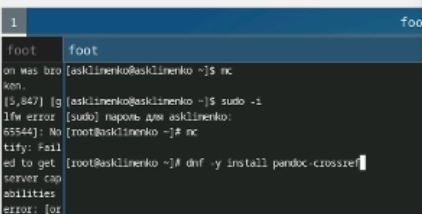

---
## Front matter
lang: ru-RU
title: Отчет по лабораторной работе №1
subtitle: Операционные системы
author:
  - Клименко Алёна Сергеевна
institute:
  - Российский университет дружбы народов, Москва, Россия

## i18n babel
babel-lang: russian
babel-otherlangs: english

## Formatting pdf
toc: false
toc-title: Содержание
slide_level: 2
aspectratio: 169
section-titles: true
theme: metropolis
header-includes:
 - \metroset{progressbar=frametitle,sectionpage=progressbar,numbering=fraction}
---

# Информация

## Докладчик

:::::::::::::: {.columns align=center}
::: {.column width="70%"}

  * Клименко Алёна Сергеевна
  * НКАбд-02-2024 № Студенческого билета: 1132246741
  * Российский университет дружбы народов
  * <https://github.com/Alstrr/study_2024-2025_os-intro>

:::
::: {.column width="30%"}

:::
::::::::::::::

## Цель работы

Целью данной работы является приобретение практических навыков установки операционной системы на виртуальную машину, настройки минимально необходимых для дальнейшей работы сервисов.

## Задание

1) Создание виртуальной машины
2) Установка операционной системы
3) Работа с операционной системой после установки
4) Установка программного обеспечения для создания документации
5) Дополнительные задания

## Создание виртуальной машины

Virtualbox я устанавливала и настраивала при выполнении лабораторной работы в курсе "Архитектура компьютера и Операционные системы (раздел "Архитектура компьютера")", поэтому сразу открываю окно приложения (рис. 1).

{#fig:001 width=70%}

##
 
Вижу интерфейс начальной конфигурации. Нажимаю Enter для создания конфигурации по умолчанию, далее нажимаю Enter, чтобы выбрать в качестве модификатора кливишу Win (рис. 2).

{#fig:002 width=70%}

##

Переключаюсь на роль супер-пользователя (рис. 3).

{#fig:003 width=70%}

##

Перехожу в директорию /tc/X11/xorg.conf.d, открываю mc для удобства, открываю файл 00-keyboard.conf (рис. 4).

{#fig:004 width=70%}

##

Запускаю терминал. Запускаю терминальный мультиплексор tmux, переключаюсь на роль супер-пользователя (рис. 5).

{#fig:005 width=70%}

##

Устанавливаю pandoc с помощью утилиты dnf и флага -y, который автоматически на все вопросы системы отчевает "yes" (рис. 6).

{#fig:006 width=70%}

##

# Выполнение дополнительного задания

Ввожу в терминале команду dmesg, чтобы проанализировать последовательность загрузки системы (рис. 7).

{#fig:007 width=70%}

## Ответы на контрольные вопросы

1) Учетная запись содержит необходимые для идентификации пользователя при подключении к системе данные, а так же информацию для авторизации и учета: системного имени (user name) (оно может содержать только латинские буквы и знак нижнее подчеркивание, еще оно должно быть уникальным), идентификатор пользователя (UID) (уникальный идентификатор пользователя в системе, целое положительное число), идентификатор группы (CID) (группа, к к-рой относится пользователь. Она, как минимум, одна, по умолчанию - одна), полное имя (full name) (Могут быть ФИО), домашний каталог (home directory) (каталог, в к-рый попадает пользователь после входа в систему и в к-ром хранятся его данные), начальная оболочка (login shell) (командная оболочка, к-рая запускается при входе в систему).
2) Для получения справки по команде: <команда> --help; для перемещения по файловой системе - cd; для просмотра содержимого каталога - ls; для определения объёма каталога - du <имя каталога>; для создания / удаления каталогов - mkdir/rmdir; для создания / удаления файлов - touch/rm; для задания определённых прав на файл / каталог - chmod; для просмотра истории команд - history
3) Файловая система - это порядок, определяющий способ организации и хранения и именования данных на различных носителях информации. Примеры: FAT32 представляет собой пространство, разделенное на три части: олна область для служебных структур, форма указателей в виде таблиц и зона для хранения самих файлов. ext3/ext4 - журналируемая файловая система, используемая в основном в ОС с ядром Linux.
4) С помощью команды df, введя ее в терминале. Это утилита, которая показывает список всех файловых систем по именам устройств, сообщает их размер и данные о памяти. Также посмотреть подмонтированные файловые системы можно с помощью утилиты mount.
5) Чтобы удалить зависший процесс, вначале мы должны узнать, какой у него id: используем команду ps. Далее в терминале вводим команду kill < id процесса >. Или можно использовать утилиту killall, что "убьет" все процессы, которые есть в данный момент, для этого не нужно знать id процесса.

## Список литературы{.unnumbered}

::: {#refs}
1. Dash P. Getting started with oracle vm virtualbox. Packt Publishing Ltd, 2013. 86 p.
2. Colvin H. Virtualbox: An ultimate guide book on virtualization with virtualbox. CreateSpace Independent Publishing Platform, 2015. 70 p.
3. van Vugt S. Red hat rhcsa/rhce 7 cert guide : Red hat enterprise linux 7 (ex200 and ex300). Pearson IT Certification, 2016. 1008 p.
4. Робачевский А., Немнюгин С., Стесик О. Операционная система unix. 2-е изд. Санкт-Петербург: БХВ-Петербург, 2010. 656 p.
5. Немет Э. et al. Unix и Linux: руководство системного администратора. 4-е изд. Вильямс, 2014. 1312 p.
6. Колисниченко Д.Н. Самоучитель системного администратора Linux. СПб.: БХВ-Петербург, 2011. 544 p.
7. Robbins A. Bash pocket reference. O’Reilly Media, 2016. 156 p.

:::