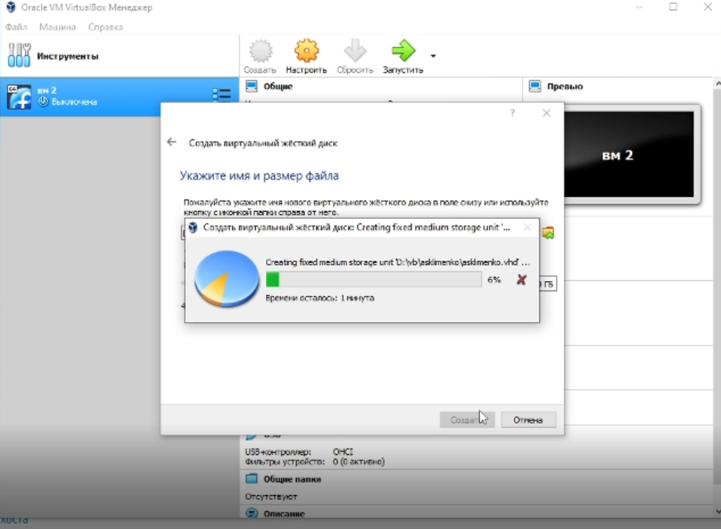
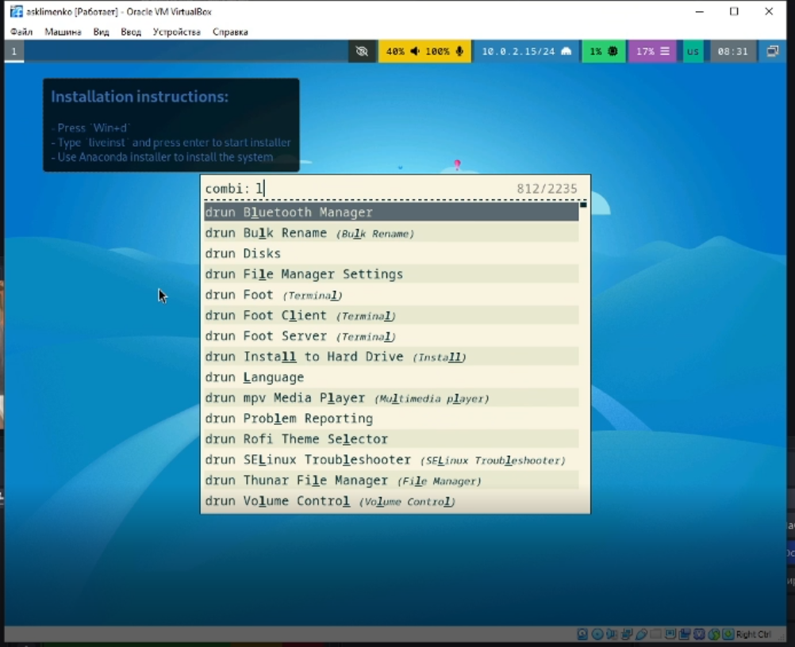
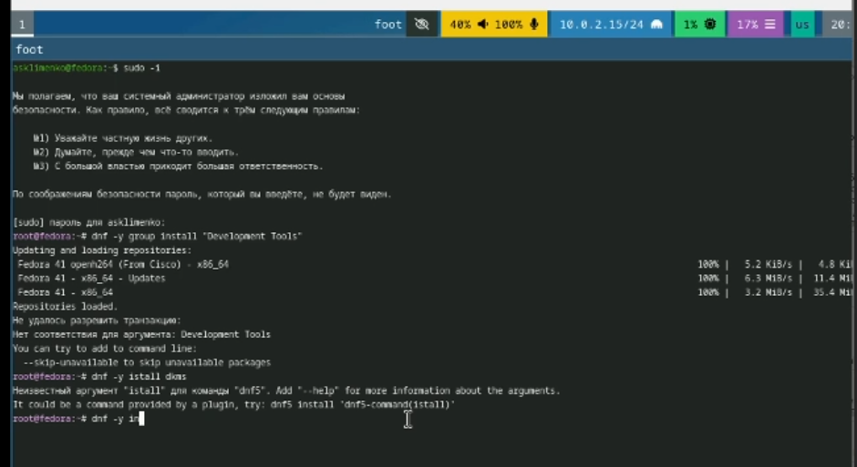
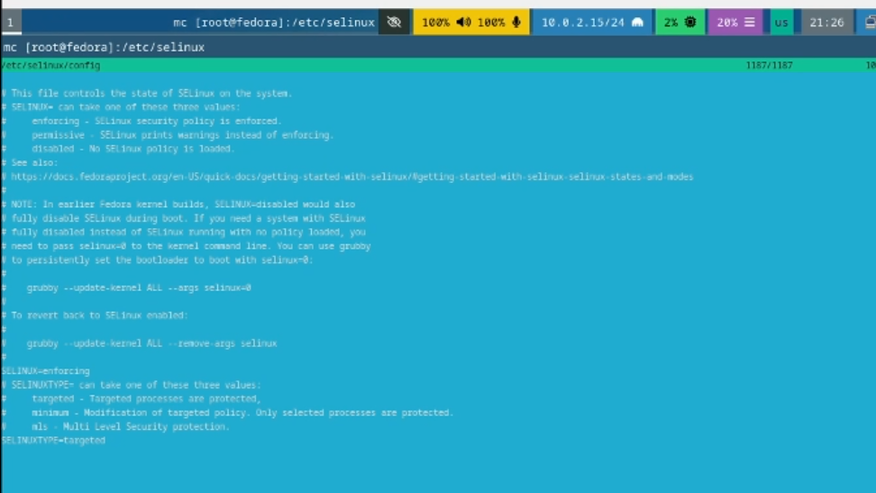
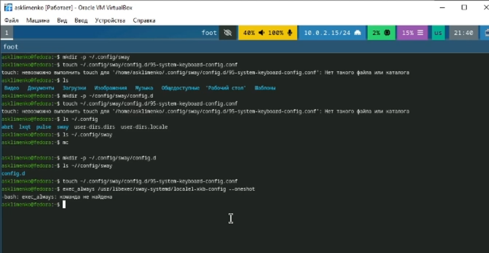
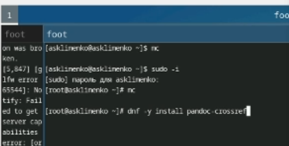
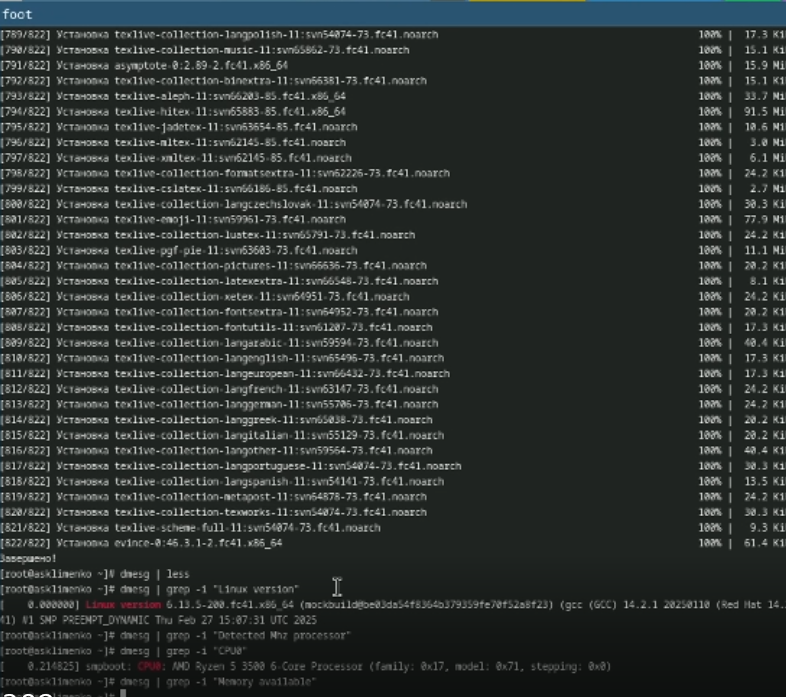

---
## Front matter
title: "Отчет по лабораторной работе №1"
subtitle: "Операционные системы"
author: "Клименко Алёна Сергеевна"

## Generic otions
lang: ru-RU
toc-title: "Содержание"

## Bibliography
bibliography: bib/cite.bib
csl: pandoc/csl/gost-r-7-0-5-2008-numeric.csl

## Pdf output format
toc: true # Table of contents
toc-depth: 2
lof: true # List of figures
lot: true # List of tables
fontsize: 12pt
linestretch: 1.5
papersize: a4
documentclass: scrreprt
## I18n polyglossia
polyglossia-lang:
  name: russian
  options:
	- spelling=modern
	- babelshorthands=true
polyglossia-otherlangs:
  name: english
## I18n babel
babel-lang: russian
babel-otherlangs: english
## Fonts
mainfont: IBM Plex Serif
romanfont: IBM Plex Serif
sansfont: IBM Plex Sans
monofont: IBM Plex Mono
mathfont: STIX Two Math
mainfontoptions: Ligatures=Common,Ligatures=TeX,Scale=0.94
romanfontoptions: Ligatures=Common,Ligatures=TeX,Scale=0.94
sansfontoptions: Ligatures=Common,Ligatures=TeX,Scale=MatchLowercase,Scale=0.94
monofontoptions: Scale=MatchLowercase,Scale=0.94,FakeStretch=0.9
mathfontoptions:
## Biblatex
biblatex: true
biblio-style: "gost-numeric"
biblatexoptions:
  - parentracker=true
  - backend=biber
  - hyperref=auto
  - language=auto
  - autolang=other*
  - citestyle=gost-numeric
## Pandoc-crossref LaTeX customization
figureTitle: "Рис."
tableTitle: "Таблица"
listingTitle: "Листинг"
lofTitle: "Список иллюстраций"
lotTitle: "Список таблиц"
lolTitle: "Листинги"
## Misc options
indent: true
header-includes:
  - \usepackage{indentfirst}
  - \usepackage{float} # keep figures where there are in the text
  - \floatplacement{figure}{H} # keep figures where there are in the text
---

# Цель работы

Целью данной работы является приобретение практических навыков установки операционной системы на виртуальную машину, настройки минимально необходимых для дальнейшей работы сервисов.

# Задание

1) Создание виртуальной машины
2) Установка операционной системы
3) Работа с операционной системой после установки
4) Установка программного обеспечения для создания документации
5) Дополнительные задания

# Выполнение лабораторной работы

## Создание виртуальной машины

Virtualbox я устанавливала и настраивала при выполнении лабораторной работы в курсе "Архитектура компьютера и Операционные системы (раздел "Архитектура компьютера")", поэтому сразу открываю окно приложения (рис. @fig:001).

{#fig:001 width=70%}
 
Вижу интерфейс начальной конфигурации. Нажимаю Enter для создания конфигурации по умолчанию, далее нажимаю Enter, чтобы выбрать в качестве модификатора кливишу Win (рис. @fig:002).

{#fig:002 width=70%}

Переключаюсь на роль супер-пользователя (рис. @fig:003).

{#fig:003 width=70%}

Перехожу в директорию /tc/X11/xorg.conf.d, открываю mc для удобства, открываю файл 00-keyboard.conf (рис. @fig:004).

{#fig:004 width=70%}

Запускаю терминал. Запускаю терминальный мультиплексор tmux, переключаюсь на роль супер-пользователя (рис. @fig:005).

{#fig:005 width=70%}

Устанавливаю pandoc с помощью утилиты dnf и флага -y, который автоматически на все вопросы системы отчевает "yes" (рис. @fig:006).

{#fig:006 width=70%}

# Выполнение дополнительного задания

Ввожу в терминале команду dmesg, чтобы проанализировать последовательность загрузки системы (рис. @fig:007).

{#fig:007 width=70%}

# Ответы на контрольные вопросы

1) Учетная запись содержит необходимые для идентификации пользователя при подключении к системе данные, а так же информацию для авторизации и учета: системного имени (user name) (оно может содержать только латинские буквы и знак нижнее подчеркивание, еще оно должно быть уникальным), идентификатор пользователя (UID) (уникальный идентификатор пользователя в системе, целое положительное число), идентификатор группы (CID) (группа, к к-рой относится пользователь. Она, как минимум, одна, по умолчанию - одна), полное имя (full name) (Могут быть ФИО), домашний каталог (home directory) (каталог, в к-рый попадает пользователь после входа в систему и в к-ром хранятся его данные), начальная оболочка (login shell) (командная оболочка, к-рая запускается при входе в систему).
2) Для получения справки по команде: <команда> --help; для перемещения по файловой системе - cd; для просмотра содержимого каталога - ls; для определения объёма каталога - du <имя каталога>; для создания / удаления каталогов - mkdir/rmdir; для создания / удаления файлов - touch/rm; для задания определённых прав на файл / каталог - chmod; для просмотра истории команд - history
3) Файловая система - это порядок, определяющий способ организации и хранения и именования данных на различных носителях информации. Примеры: FAT32 представляет собой пространство, разделенное на три части: олна область для служебных структур, форма указателей в виде таблиц и зона для хранения самих файлов. ext3/ext4 - журналируемая файловая система, используемая в основном в ОС с ядром Linux.
4) С помощью команды df, введя ее в терминале. Это утилита, которая показывает список всех файловых систем по именам устройств, сообщает их размер и данные о памяти. Также посмотреть подмонтированные файловые системы можно с помощью утилиты mount.
5) Чтобы удалить зависший процесс, вначале мы должны узнать, какой у него id: используем команду ps. Далее в терминале вводим команду kill < id процесса >. Или можно использовать утилиту killall, что "убьет" все процессы, которые есть в данный момент, для этого не нужно знать id процесса.

# Выводы

При выполнении данной лабораторной работы я приобрела практические навыки установки операционной системы на виртуальную машину, а так же сделала настройки минимально необходимых для дальнейшей работы сервисов.

# Список литературы{.unnumbered}

::: {#refs}
:::

   