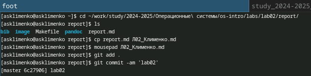
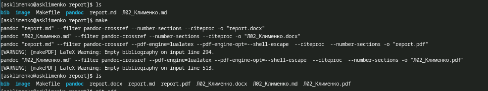
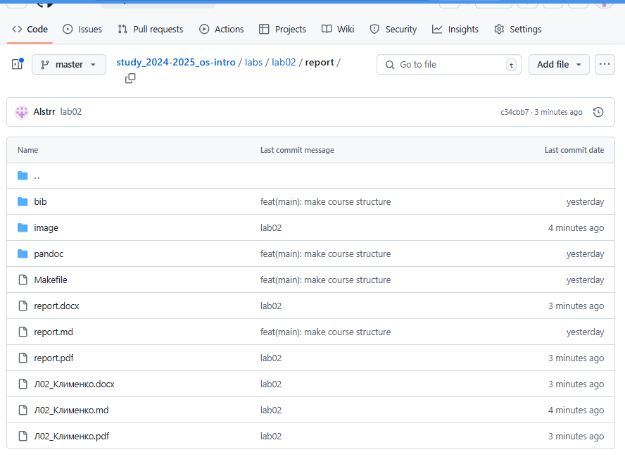
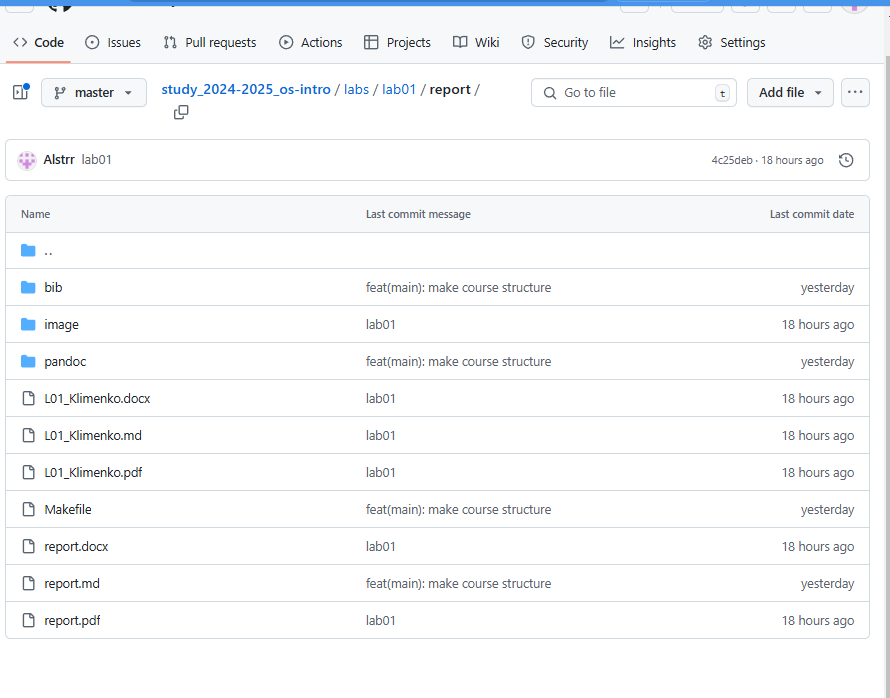

---
## Front matter
lang: ru-RU
title: Отчет по лабораторной работе №1
subtitle: Операционные системы
author:
  - Клименко Алёна Сергеевна
institute:
  - Российский университет дружбы народов, Москва, Россия

## i18n babel
babel-lang: russian
babel-otherlangs: english

## Formatting pdf
toc: false
toc-title: Содержание
slide_level: 2
aspectratio: 169
section-titles: true
theme: metropolis
header-includes:
 - \metroset{progressbar=frametitle,sectionpage=progressbar,numbering=fraction}
---

# Информация

## Докладчик

:::::::::::::: {.columns align=center}
::: {.column width="70%"}

  * Клименко Алёна Сергеевна
  * НКАбд-02-2024 № Студенческого билета: 1132246741
  * Российский университет дружбы народов
  * <https://github.com/Alstrr/study_2024-2025_os-intro>

:::
::: {.column width="30%"}

:::
::::::::::::::

## Цель работы

Добавить к сайту достижения.

## Задание

создать отчеты

## Выполнение лабораторной работы

копирую файл report.md переименовав его и выгружаю в гит (рис. 1).

##

Использую make (рис. 2).

##

Выгрузила файлы 2 лабораторной работы (рис. 3).

##

Выгрузила файлы 1 лабораторной работы (рис. 4).

## Выводы

написала отчеты к лабораторным работам

## Список литературы{.unnumbered}

::: {#refs}
:::
