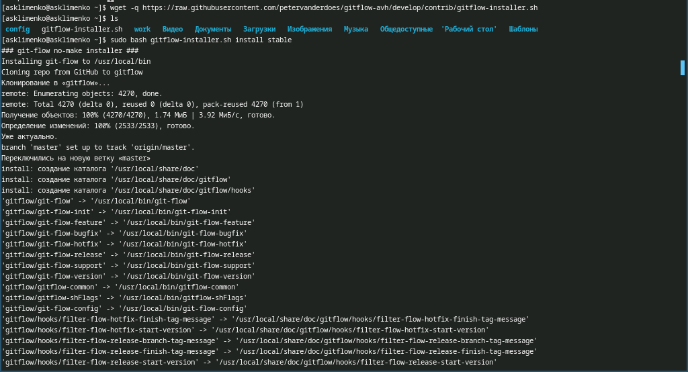
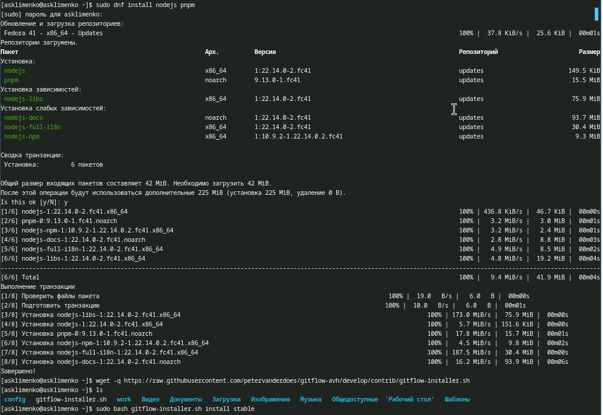
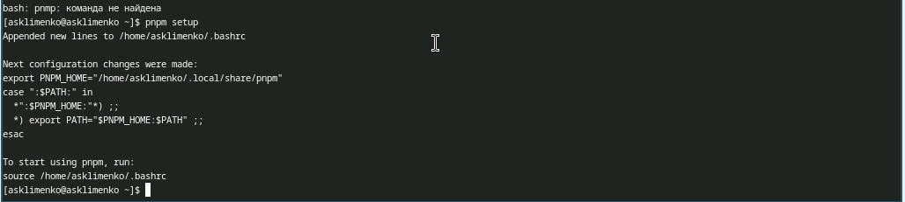
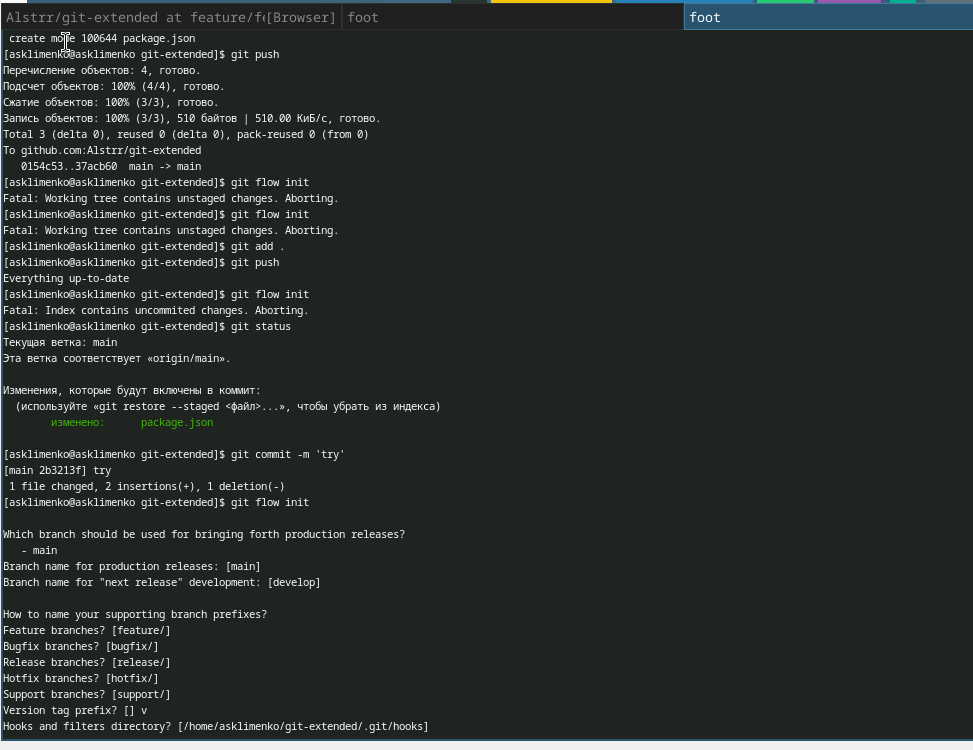
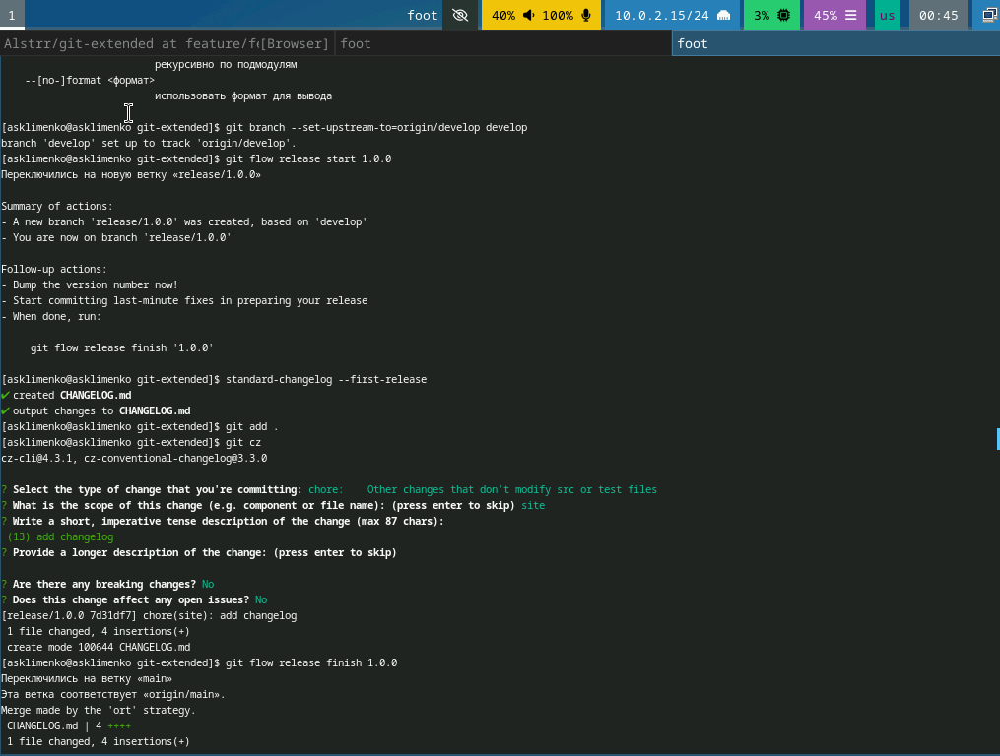
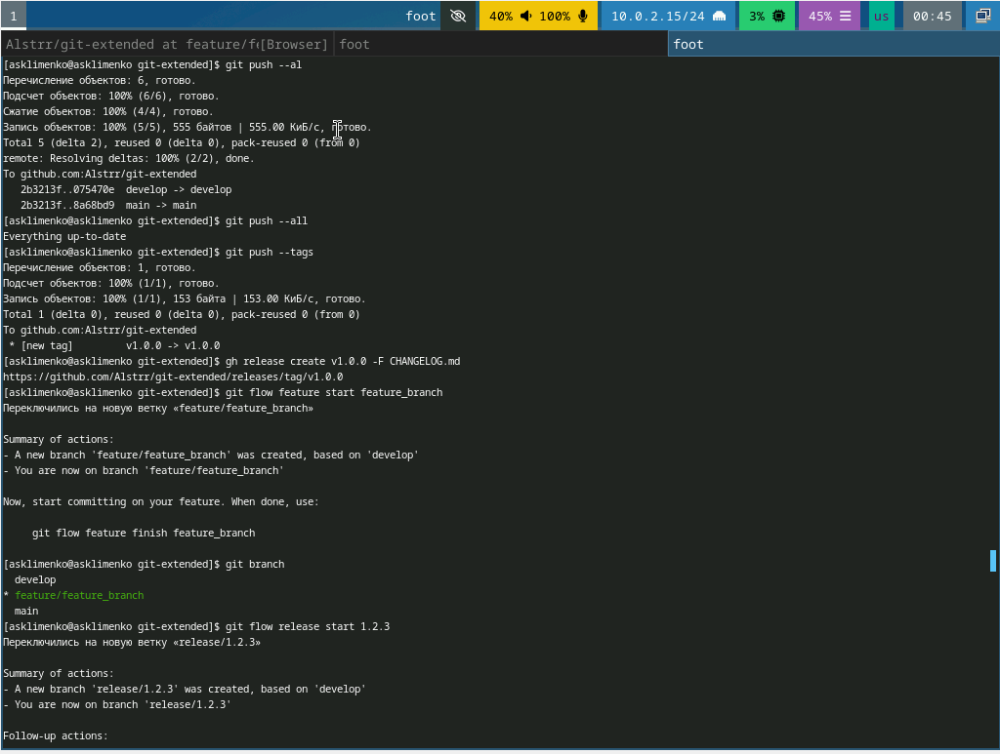
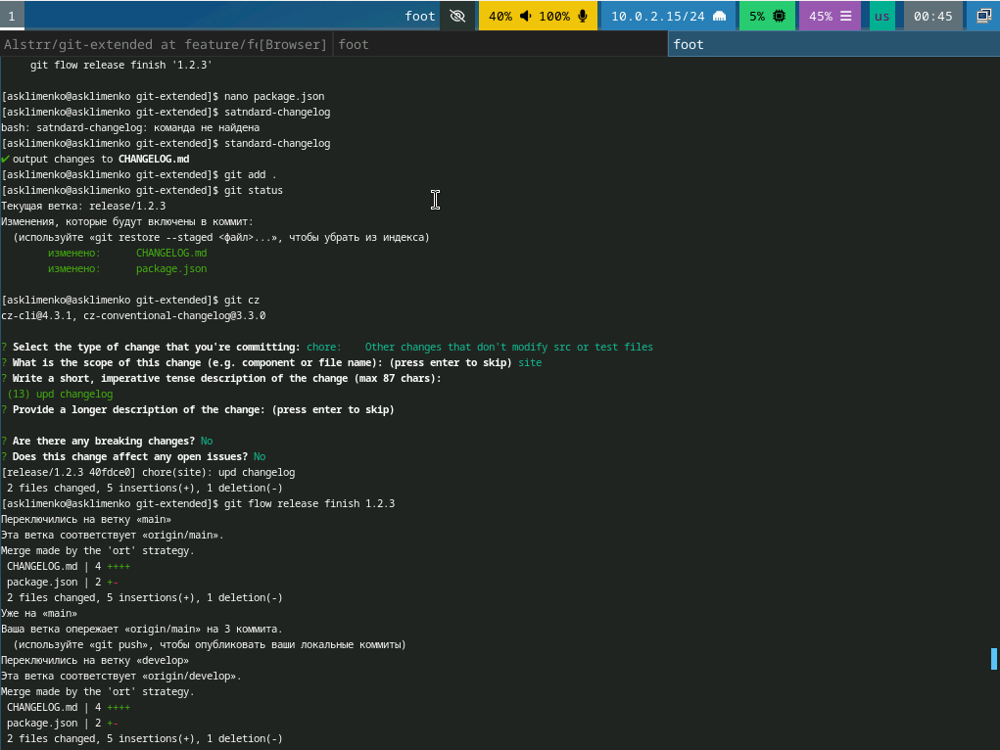
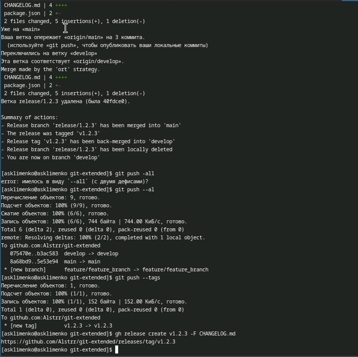

---
## Front matter
lang: ru-RU
title: Отчет по лабораторной работе №4
subtitle: Операционные системы
author:
  - Клименко Алёна Сергеевна
institute:
  - Российский университет дружбы народов, Москва, Россия

## i18n babel
babel-lang: russian
babel-otherlangs: english

## Formatting pdf
toc: false
toc-title: Содержание
slide_level: 2
aspectratio: 169
section-titles: true
theme: metropolis
header-includes:
 - \metroset{progressbar=frametitle,sectionpage=progressbar,numbering=fraction}
---

# Информация

## Докладчик

:::::::::::::: {.columns align=center}
::: {.column width="70%"}

  * Клименко Алёна Сергеевна
  * НКАбд-02-2024 № Студенческого билета: 1132246741
  * Российский университет дружбы народов
  * <https://github.com/Alstrr/study_2024-2025_os-intro>

:::
::: {.column width="30%"}

:::
::::::::::::::

## Цель работы

Получение навыков правильной работы с репозиториями git.

## Задание

1. Выполнить работу для тестового репозитория.
2. Преобразовать рабочий репозиторий в репозиторий с git-flow и conventional commits.

## Теоретическое введение

## Рабочий процесс Gitflow

Рабочий процесс Gitflow Workflow. Будем описывать его с использованием пакета git-flow.
Общая информация
Gitflow Workflow опубликована и популяризована Винсентом Дриссеном.
Gitflow Workflow предполагает выстраивание строгой модели ветвления с учётом выпуска проекта.
Данная модель отлично подходит для организации рабочего процесса на основе релизов.
Работа по модели Gitflow включает создание отдельной ветки для исправлений ошибок в рабочей среде.
Последовательность действий при работе по модели Gitflow:
Из ветки master создаётся ветка develop.
Из ветки develop создаётся ветка release.
Из ветки develop создаются ветки feature.
Когда работа над веткой feature завершена, она сливается с веткой develop.
Когда работа над веткой релиза release завершена, она сливается в ветки develop и master.
Если в master обнаружена проблема, из master создаётся ветка hotfix.
Когда работа над веткой исправления hotfix завершена, она сливается в ветки develop и master.

## Выполнение лабораторной работы

## Установка программного обеспечения.

## Установка git-flow
 Открываем терминал и входим в режим суперпользователя, устанавливаем gitflow. (рис. 1).

## Установка и настройка node.js

 Устанавливаем pnpm и nodejs. (рис. 2).

## 

 Настраиваем nodejs. (рис. 3).

## Общепринятые коммиты.

 Настраиваем commitizen и standard-changelog (рис. 4).

## Создание репозитория git.

 Создаем репозиторий git, настраиваем его и делаем в него первый коммит. Настраиваем пакет файлов nodejs  (рис. 5).

используем git cz (рис. 6). 

вфплняем коммиты создаем новую ветку проверяем через git branch и делаем релиз (рис. 7).

 Выполняем коммит (рис. 8). Выкладываем на github. (рис. 9). 

##

## Выводы

В процессе выполнения лабораторной работы я приобрела навыки правильной работы с репозиториями git.

## Список литературы{.unnumbered}

::: {#refs}
:::