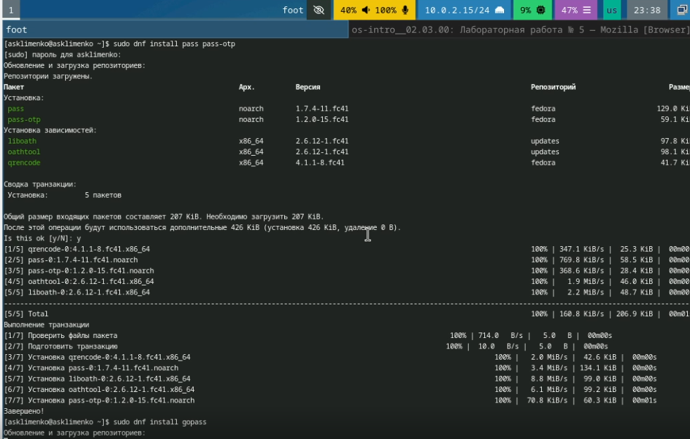
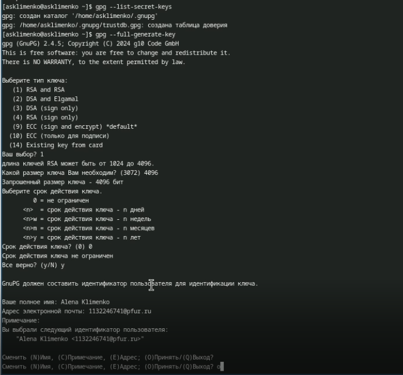
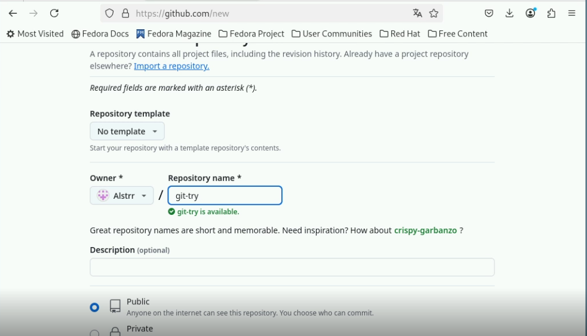
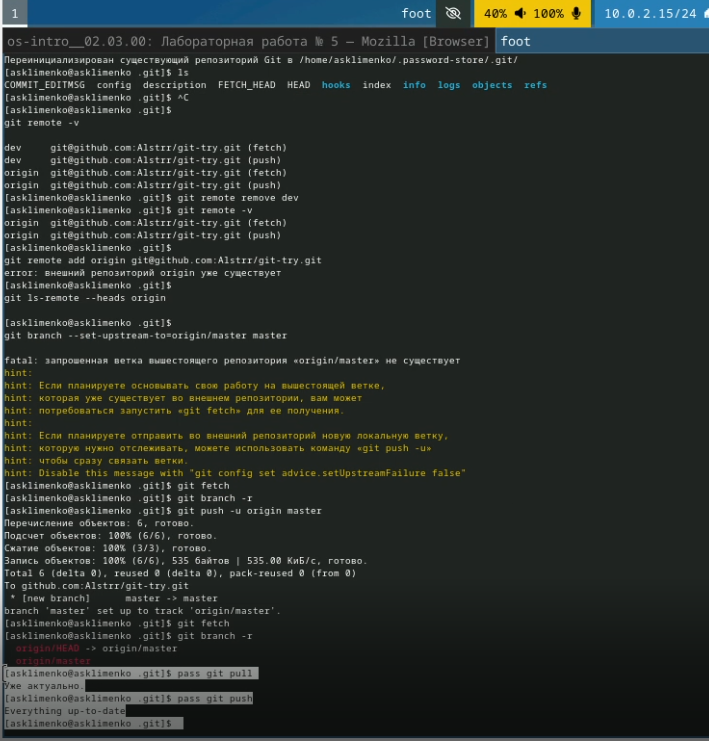
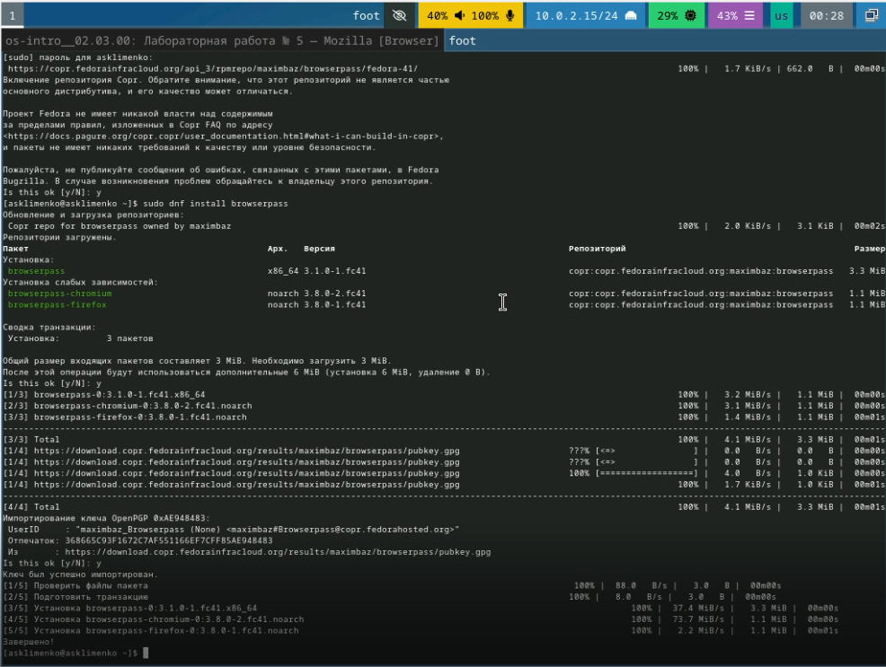
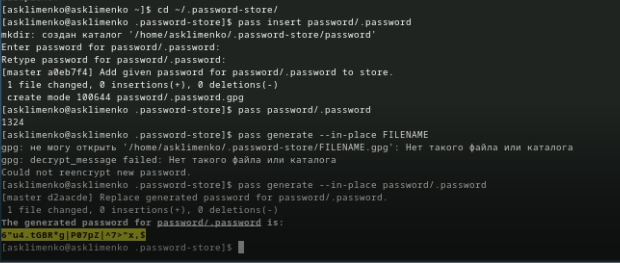
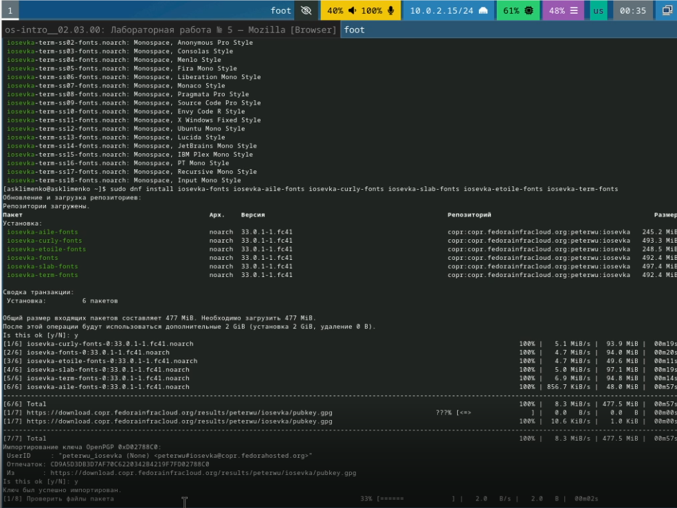
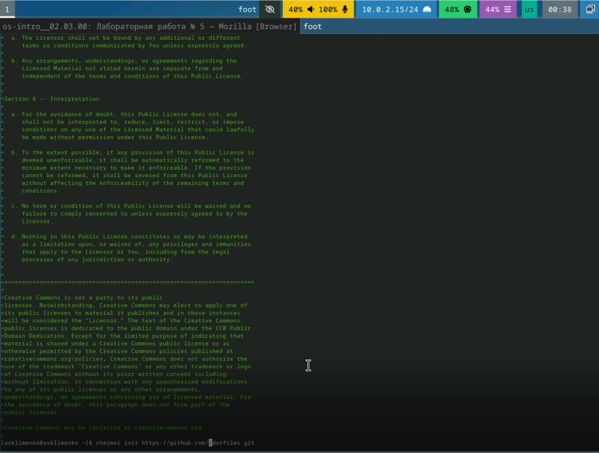
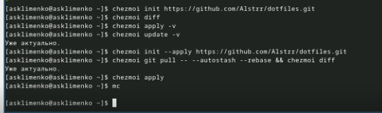

---
## Front matter
lang: ru-RU
title: Отчет по лабораторной работе №5
subtitle: Операционные системы
author:
  - Клименко Алёна Сергеевна
institute:
  - Российский университет дружбы народов, Москва, Россия

## i18n babel
babel-lang: russian
babel-otherlangs: english

## Formatting pdf
toc: false
toc-title: Содержание
slide_level: 2
aspectratio: 169
section-titles: true
theme: metropolis
header-includes:
 - \metroset{progressbar=frametitle,sectionpage=progressbar,numbering=fraction}
---

# Информация

## Докладчик

:::::::::::::: {.columns align=center}
::: {.column width="70%"}

  * Клименко Алёна Сергеевна
  * НКАбд-02-2024 № Студенческого билета: 1132246741
  * Российский университет дружбы народов
  * <https://github.com/Alstrr/study_2024-2025_os-intro>

:::
::: {.column width="30%"}

:::
::::::::::::::

## Цель работы

Познакомиться с pass, gopass, native messaging, chezmoi. Научиться пользоваться этими утилитами, синхронизировать их с гит.

## Задание

1. Установить дополнительное ПО
2. Установить и настроить pass
3. Настроить интерфейс с браузером
4. Сохранить пароль
5. Установить и настроить chezmoi
6. Настроить chezmoi на новой машине
7. Выполнить ежедневные операции с chezmoi

## Теоретическое введение

Менеджер паролей pass — программа, сделанная в рамках идеологии Unix. Также носит название стандартного менеджера паролей для Unix (The standard Unix password manager).
1.1 Основные свойства
    Данные хранятся в файловой системе в виде каталогов и файлов.
    Файлы шифруются с помощью GPG-ключа.
1.2 Структура базы паролей
    Структура базы может быть произвольной, если Вы собираетесь использовать её напрямую, без промежуточного программного обеспечения. Тогда семантику структуры базы данных Вы держите в своей голове.
    Если же необходимо использовать дополнительное программное обеспечение, необходимо семантику заложить в структуру базы паролей.
chezmoi используется для управления файлами конфигурации домашнего каталога пользователя. 
Конфигурация chezmoi
    2.2.1 Рабочие файлы
    Состояние файлов конфигурации сохраняется в каталоге ~/.local/share/chezmoi. Он является клоном вашего репозитория dotfiles.
    Файл конфигурации ~/.config/chezmoi/chezmoi.toml (можно использовать также JSON или YAML) специфичен для локальной машины.
    Файлы, содержимое которых одинаково на всех ваших машинах, дословно копируются из исходного каталога.
    Файлы, которые варьируются от машины к машине, выполняются как шаблоны, обычно с использованием данных из файла конфигурации локальной машины для настройки конечного содержимого, специфичного для локальной машины.

## Выполнение лабораторной работы

## Менеджер паролей pass. Установка, настройка.
Устанавливаем pass и gopass (рис. 1). 

## проверяем какие gpg ключи есть, так как их не было, то я создала новые (рис. 2). 

## создаю новые репозиторий для того, чтобы задать его адрес на хостинге (рис. 3).

## Для синхронизации выполняется следующая команда:  pass git pull pass git push Следует заметить, что отслеживаются только изменения, сделанные через сам gopass (или pass). Если изменения сделаны непосредственно на файловой системе, необходимо вручную закоммитить и выложить изменения. Проверим статус синхронизации. (рис. 4).

## Для взаимодействия с броузером используем интерфейс native messaging. Кроме плагина к броузеру устанавливается программа, обеспечивающая интерфейс native messaging. (рис. 5). 

## задаю пароль потом вывожу пароль с помощью команды pass <name> и потом генерирую новый (рис. 6).

## устанавливаю все расширения (рис. 7).

## chezmoi (рис. 8).

## выполняю команды chezmoi, которые присутсвуют в лабораторной работе, но все данные уже актуальны, благодаря предыдущим действиям (рис. 9).

## Выводы

Мы познакомились с pass, gopass, native messaging, chezmoi. Научились пользоваться этими утилитами, синхронизировали их с гит.

## Список литературы{.unnumbered}

Настройка электронной среды. (электронный ресурс) URL: https://yamadharma.github.io/ru/teaching/os-intro/lab/lab-work-environment-setup/

::: {#refs}
:::

