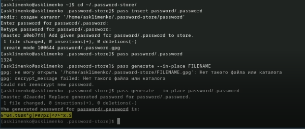

---
## Front matter
title: "Отчет по лабораторной работе № 5"
subtitle: Операционные системы
author: "Клименко Алёна Сергеевна"

## Generic otions
lang: ru-RU
toc-title: "Содержание"

## Bibliography
bibliography: bib/cite.bib
csl: pandoc/csl/gost-r-7-0-5-2008-numeric.csl

## Pdf output format
toc: true # Table of contents
toc-depth: 2
lof: true # List of figures
lot: true # List of tables
fontsize: 12pt
linestretch: 1.5
papersize: a4
documentclass: scrreprt
## I18n polyglossia
polyglossia-lang:
  name: russian
  options:
	- spelling=modern
	- babelshorthands=true
polyglossia-otherlangs:
  name: english
## I18n babel
babel-lang: russian
babel-otherlangs: english
## Fonts
mainfont: IBM Plex Serif
romanfont: IBM Plex Serif
sansfont: IBM Plex Sans
monofont: IBM Plex Mono
mathfont: STIX Two Math
mainfontoptions: Ligatures=Common,Ligatures=TeX,Scale=0.94
romanfontoptions: Ligatures=Common,Ligatures=TeX,Scale=0.94
sansfontoptions: Ligatures=Common,Ligatures=TeX,Scale=MatchLowercase,Scale=0.94
monofontoptions: Scale=MatchLowercase,Scale=0.94,FakeStretch=0.9
mathfontoptions:
## Biblatex
biblatex: true
biblio-style: "gost-numeric"
biblatexoptions:
  - parentracker=true
  - backend=biber
  - hyperref=auto
  - language=auto
  - autolang=other*
  - citestyle=gost-numeric
## Pandoc-crossref LaTeX customization
figureTitle: "Рис."
tableTitle: "Таблица"
listingTitle: "Листинг"
lofTitle: "Список иллюстраций"
lotTitle: "Список таблиц"
lolTitle: "Листинги"
## Misc options
indent: true
header-includes:
  - \usepackage{indentfirst}
  - \usepackage{float} # keep figures where there are in the text
  - \floatplacement{figure}{H} # keep figures where there are in the text
---
# Цель работы

Познакомиться с pass, gopass, native messaging, chezmoi. Научиться пользоваться этими утилитами, синхронизировать их с гит.

# Задание

1. Установить дополнительное ПО
2. Установить и настроить pass
3. Настроить интерфейс с браузером
4. Сохранить пароль
5. Установить и настроить chezmoi
6. Настроить chezmoi на новой машине
7. Выполнить ежедневные операции с chezmoi

# Теоретическое введение

Менеджер паролей pass — программа, сделанная в рамках идеологии Unix. Также носит название стандартного менеджера паролей для Unix (The standard Unix password manager).
1.1 Основные свойства
    Данные хранятся в файловой системе в виде каталогов и файлов.
    Файлы шифруются с помощью GPG-ключа.
1.2 Структура базы паролей
    Структура базы может быть произвольной, если Вы собираетесь использовать её напрямую, без промежуточного программного обеспечения. Тогда семантику структуры базы данных Вы держите в своей голове.
    Если же необходимо использовать дополнительное программное обеспечение, необходимо семантику заложить в структуру базы паролей.
chezmoi используется для управления файлами конфигурации домашнего каталога пользователя. 
Конфигурация chezmoi
    2.2.1 Рабочие файлы
    Состояние файлов конфигурации сохраняется в каталоге ~/.local/share/chezmoi. Он является клоном вашего репозитория dotfiles.
    Файл конфигурации ~/.config/chezmoi/chezmoi.toml (можно использовать также JSON или YAML) специфичен для локальной машины.
    Файлы, содержимое которых одинаково на всех ваших машинах, дословно копируются из исходного каталога.
    Файлы, которые варьируются от машины к машине, выполняются как шаблоны, обычно с использованием данных из файла конфигурации локальной машины для настройки конечного содержимого, специфичного для локальной машины.

# Выполнение лабораторной работы

## Менеджер паролей pass. Установка, настройка.
Устанавливаем pass и gopass (рис. @fig:001). 

{#fig:001 width=70%}

проверяем какие gpg ключи есть, так как их не было, то я создала новые (рис. @fig:002). 

{#fig:002 width=70%}

создаю новые репозиторий для того, чтобы задать его адрес на хостинге (рис. @fig:003).

{#fig:003 width=70%}

Для синхронизации выполняется следующая команда:  pass git pull pass git push Следует заметить, что отслеживаются только изменения, сделанные через сам gopass (или pass). Если изменения сделаны непосредственно на файловой системе, необходимо вручную закоммитить и выложить изменения. Проверим статус синхронизации. (рис. @fig:004).

{#fig:004 width=70%}

Для взаимодействия с броузером используем интерфейс native messaging. Кроме плагина к броузеру устанавливается программа, обеспечивающая интерфейс native messaging. (рис. @fig:005). 

{#fig:005 width=70%}

задаю пароль потом вывожу пароль с помощью команды pass <name> и потом генерирую новый (рис. @fig:006).

{#fig:006 width=70%}

устанавливаю все расширения (рис. @fig:007).

{#fig:007 width=70%}

chezmoi (рис. @fig:008).

{#fig:008 width=70%} 

выполняю команды chezmoi, которые присутсвуют в лабораторной работе, но все данные уже актуальны, благодаря предыдущим действиям (рис. @fig:009).

{#fig:009 width=70%} 

# Выводы

Мы познакомились с pass, gopass, native messaging, chezmoi. Научились пользоваться этими утилитами, синхронизировали их с гит.

# Список литературы{.unnumbered}

Настройка электронной среды. (электронный ресурс) URL: https://yamadharma.github.io/ru/teaching/os-intro/lab/lab-work-environment-setup/

::: {#refs}
:::