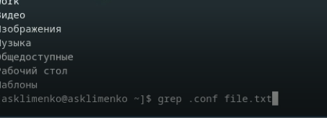
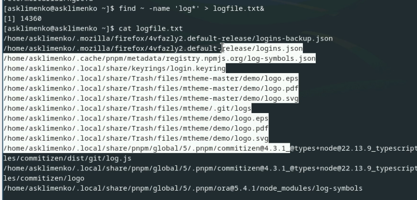
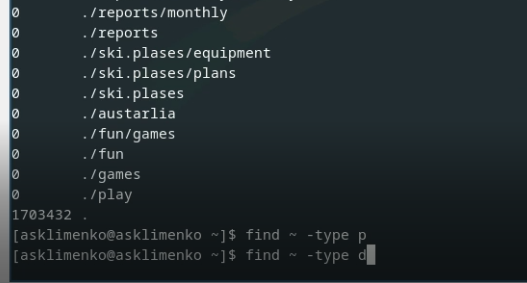

---
## Front matter
lang: ru-RU
title: Отчет по лабораторной работе №8
subtitle: Операционные системы
author:
  - Клименко Алёна Сергеевна
institute:
  - Российский университет дружбы народов, Москва, Россия

## i18n babel
babel-lang: russian
babel-otherlangs: english

## Formatting pdf
toc: false
toc-title: Содержание
slide_level: 2
aspectratio: 169
section-titles: true
theme: metropolis
header-includes:
 - \metroset{progressbar=frametitle,sectionpage=progressbar,numbering=fraction}
---

# Информация

## Докладчик

:::::::::::::: {.columns align=center}
::: {.column width="70%"}

  * Клименко Алёна Сергеевна
  * НКАбд-02-2024 № Студенческого билета: 1132246741
  * Российский университет дружбы народов
  * <https://github.com/Alstrr/study_2024-2025_os-intro>

:::
::: {.column width="30%"}

:::
::::::::::::::

##  Цель 

Ознакомление с инструментами поиска файлов и фильтрации текстовых данных.
Приобретение практических навыков: по управлению процессами (и заданиями), по
проверке использования диска и обслуживанию файловых систем.

## Задание

1. Осуществите вход в систему, используя соответствующее имя пользователя.
2. Запишите в файл file.txt названия файлов, содержащихся в каталоге /etc. Допи-
шите в этот же файл названия файлов, содержащихся в вашем домашнем каталоге.
3. Выведите имена всех файлов из file.txt, имеющих расширение .conf, после чего
запишите их в новый текстовой файл conf.txt.
4. Определите, какие файлы в вашем домашнем каталоге имеют имена, начинавшиеся
с символа c? Предложите несколько вариантов, как это сделать.
5. Выведите на экран (по странично) имена файлов из каталога /etc, начинающиеся
с символа h.

## 

6. Запустите в фоновом режиме процесс, который будет записывать в файл ~/logfile
файлы, имена которых начинаются с log.
7. Удалите файл ~/logfile.
8. Запустите из консоли в фоновом режиме редактор gedit.
9. Определите идентификатор процесса gedit, используя команду ps, конвейер и фильтр
grep. Как ещё можно определить идентификатор процесса?
10. Прочтите справку (man) команды kill, после чего используйте её для завершения
процесса gedit.
11. Выполните команды df и du, предварительно получив более подробную информацию
об этих командах, с помощью команды man.
12. Воспользовавшись справкой команды find, выведите имена всех директорий, имею-
щихся в вашем домашнем каталоге.

## Теоретическое введение

В системе по умолчанию открыто три специальных потока:
– stdin — стандартный поток ввода (по умолчанию: клавиатура), файловый дескриптор
0;
– stdout — стандартный поток вывода (по умолчанию: консоль), файловый дескриптор
1;
– stderr — стандартный поток вывод сообщений об ошибках (по умолчанию: консоль),
файловый дескриптор 2.

## 

Большинство используемых в консоли команд и программ записывают результаты
своей работы в стандартный поток вывода stdout. Например, команда ls выводит в стан-
дартный поток вывода (консоль) список файлов в текущей директории. Потоки вывода
и ввода можно перенаправлять на другие файлы или устройства. Проще всего это делается
с помощью символов >, >>, <, <<.
Конвейер (pipe) служит для объединения простых команд или утилит в цепочки, в ко-
торых результат работы предыдущей команды передаётся последующей. 
Команда find используется для поиска и отображения на экран имён файлов, соответ-
ствующих заданной строке символов.

# Выполнение лабораторной работы

##  1. Осуществите вход в систему, используя соответствующее имя пользователя. Запишите в файл file.txt названия файлов, содержащихся в каталоге /etc. Допи-
шите в этот же файл названия файлов, содержащихся в вашем домашнем каталоге. (рис. 1). 

## 2.  Выведите имена всех файлов из file.txt, имеющих расширение .conf, после чего
запишите их в новый текстовой файл conf.txt. (рис. 2). 

## 3. Определите, какие файлы в вашем домашнем каталоге имеют имена, начинавшиеся
с символа c?  (рис. 3). 

## 4.  Запустите в фоновом режиме процесс, который будет записывать в файл ~/logfile
файлы, имена которых начинаются с log. Удалите файл ~/logfile. (рис. 4). (рис. 5).

## 

## 5. Запустите из консоли в фоновом режиме редактор gedit. Определите идентификатор процесса gedit, используя команду ps, конвейер и фильтр
grep. Прочтите справку (man) команды kill, после чего используйте её для завершения
процесса gedit. (рис. 6). 

## 6. Выполните команды df и du, предварительно получив более подробную информацию
об этих командах, с помощью команды man. (рис. 7).

8. Воспользовавшись справкой команды find, выведите имена всех директорий, имею-
щихся в вашем домашнем каталоге. рис. 8). 

# Контрольные вопросы

1. Какие потоки ввода вывода вы знаете?
В системе по умолчанию открыто три специальных потока: – stdin — стандартный поток ввода (по умолчанию: клавиатура), файловый дескриптор 0; – stdout — стандартный поток вывода (по умолчанию: консоль), файловый дескриптор 1; – stderr — стандартный поток вывод сообщений об ошибках (по умолчанию: консоль), файловый дескриптор 2.

2. Объясните разницу между операцией > и >>.
Этот знак > - перенаправление ввода/вывода, а >> - перенаправление в режиме добавления.

3. Что такое конвейер?
Конвейер (pipe) служит для объединения простых команд или утилит в цепочки, в которых результат работы предыдущей команды передаётся последующей.

4. Что такое процесс? Чем это понятие отличается от программы?
Главное отличие между программой и процессом заключается в том, что программа - это набор инструкций, который позволяет ЦПУ выполнять определенную задачу, в то время как процесс - это исполняемая программа.

5. Что такое PID и GID?
PPID - (parent process ID) идентификатор родительского процесса. Процесс может порождать и другие процессы. UID, GID - реальные идентификаторы пользователя и его группы, запустившего данный процесс.

## 

6. Что такое задачи и какая команда позволяет ими управлять?
Запущенные фоном программы называются задачами (jobs). Ими можно управлять с помощью команды jobs, которая выводит список запущенных в данный момент задач.

7. Найдите информацию об утилитах top и htop. Каковы их функции?
Команда htop похожа на команду top по выполняемой функции: они обе показывают информацию о процессах в реальном времени, выводят данные о потреблении системных ресурсов и позволяют искать, останавливать и управлять процессами.

8. У обеих команд есть свои преимущества. Например, в программе htop реализован очень удобный поиск по процессам, а также их фильтрация. В команде top это не так удобно — нужно знать кнопку для вывода функции поиска.
Зато в top можно разделять область окна и выводить информацию о процессах в соответствии с разными настройками. В целом top намного более гибкая в настройке отображения процессов.

9. Назовите и дайте характеристику команде поиска файлов. Приведите примеры использования этой команды.
Команда find - это одна из наиболее важных и часто используемых утилит системы Linux. Это команда для поиска файлов и каталогов на основе специальных условий. Ее можно использовать в различных обстоятельствах, например, для поиска файлов по разрешениям, владельцам, группам, типу, размеру и другим подобным критериям.
Утилита find предустановлена по умолчанию во всех Linux дистрибутивах, поэтому вам не нужно будет устанавливать никаких дополнительных пакетов. Это очень важная находка для тех, кто хочет использовать командную строку наиболее эффективно.
Команда find имеет такой синтаксис: find [папка] [параметры] критерий шаблон [действие] Пример: find /etc -name "p*" -print

## 

10. Можно ли по контексту (содержанию) найти файл? Если да, то как?
find / -type f -exec grep -H 'текстДляПоиска' {} ;

11. Как определить объем свободной памяти на жёстком диске?
С помощью команды df -h.

12. Как определить объем вашего домашнего каталога?
С помощью команды du -s.

13. Как удалить зависший процесс?
С помощью команды kill% номер задачи.

##  Выводы

Мы ознакомились с инструментами поиска файлов и фильтрации текстовых данных.
Приобрели практических навыков: по управлению процессами (и заданиями), по
проверке использования диска и обслуживанию файловых систем.

# Список литературы{.unnumbered}

::: {#refs}
:::