---
## Front matter
lang: ru-RU
title: Отчет по лабораторной работе №1
subtitle: Операционные системы
author:
  - Клименко Алёна Сергеевна
institute:
  - Российский университет дружбы народов, Москва, Россия

## i18n babel
babel-lang: russian
babel-otherlangs: english

## Formatting pdf
toc: false
toc-title: Содержание
slide_level: 2
aspectratio: 169
section-titles: true
theme: metropolis
header-includes:
 - \metroset{progressbar=frametitle,sectionpage=progressbar,numbering=fraction}
---

# Информация

## Докладчик

:::::::::::::: {.columns align=center}
::: {.column width="70%"}

  * Клименко Алёна Сергеевна
  * НКАбд-02-2024 № Студенческого билета: 1132246741
  * Российский университет дружбы народов
  * <https://github.com/Alstrr/study_2024-2025_os-intro>

:::
::: {.column width="30%"}

:::
::::::::::::::

## Цель работы

Просмотреть видео и на основе полученной информации пройти тестовые задания.

## Задание

Просмотреть видео и на основе полученной информации пройти тестовые задания.

## Теоретическое введение

Линукс - в части случаев GNU/Linux — семейство Unix-подобных операционных систем на базе ядра Linux, включающих тот или иной набор утилит и программ проекта GNU, и, возможно, другие компоненты. Как и ядро Linux, системы на его основе, как правило, создаются и распространяются в соответствии с моделью разработки свободного и открытого программного обеспечения. Linux-системы распространяются в основном бесплатно в виде различных дистрибутивов — в форме, готовой для установки и удобной для сопровождения и обновлений, — и имеющих свой набор системных и прикладных компонентов, как свободных, так и проприетарных.

## Выполнение лабораторной работы

## 1) Курс действительно называется “Введение в Linux”, поэтому с этим вопросом проблем не возникло. (рис. 1).

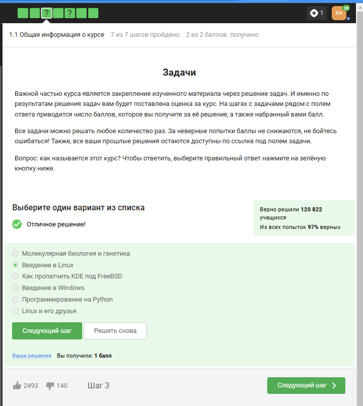

## 2) Прочитав критерии прохождения курса, я отметила необходимые утверждения. (рис. 2).

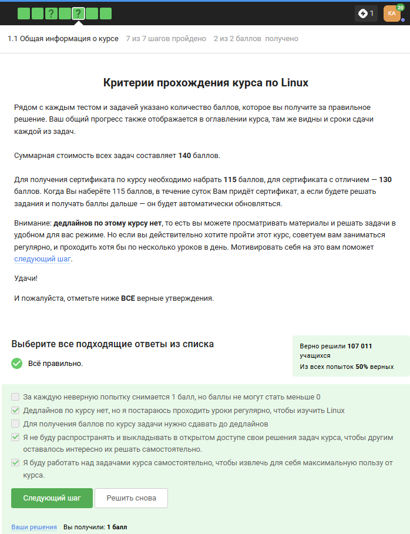
 
## 3) Стандартная операционная система, предлагаемая большей частью магазинов - windows, именно она стоит у меня на основном компьютере. (рис. 3).

## 4) На свой компьютер мы устанавливали специальную программу VirtualBox, которая нужна для подключения одной операционной на другой. (рис. 4).

## 5) Да, моя виртуальная машина хорошо работает, и у меня получилось запустить с неё Линукс, но в последнее время я чаще использую ноутбук, на котором Линукс стоит как основная операционная система. (рис. 5).

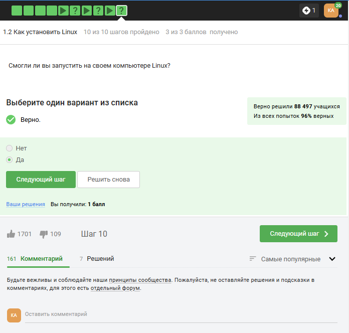

## 6) Я создала документ, и перед сохранением выбрала нужный формат, а после я ег прикрепила к курсу. Прикрепленный файл видно на скриншоте. (рис. 6).
 
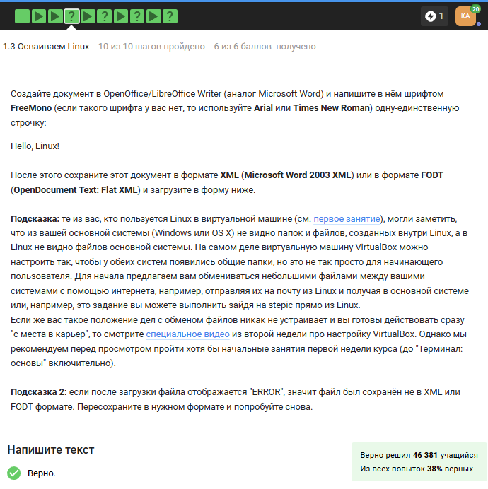

## 7) deb — формат пакетов операционных систем проекта Debian. Используется также их производными, такими как Ubuntu, Knoppix и другими. (рис. 7).
 
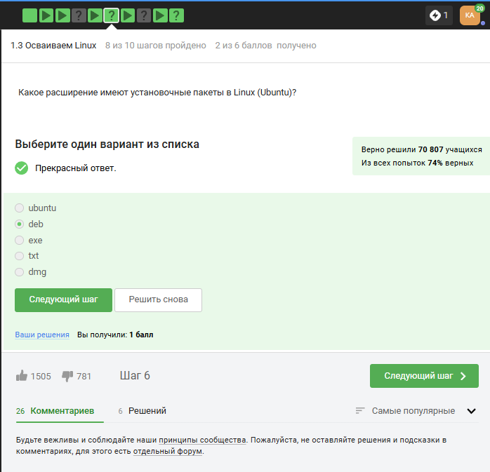

## 8) Здесь на скриншоте видно, что установив программу медиапроигрывателя я посмотрела, кто авторы программы и записала первую фамилию. (рис. 8]).
 

## 9) Менеджер обновлений — это программа для обновления установленного программного обеспечения в дистрибутивах ОС Linux, основанных на Debian или использующих систему управления пакетами APT. Менеджер обновлений устанавливает обновления безопасности или просто улучшающие функциональность программы. (рис. 9).
 
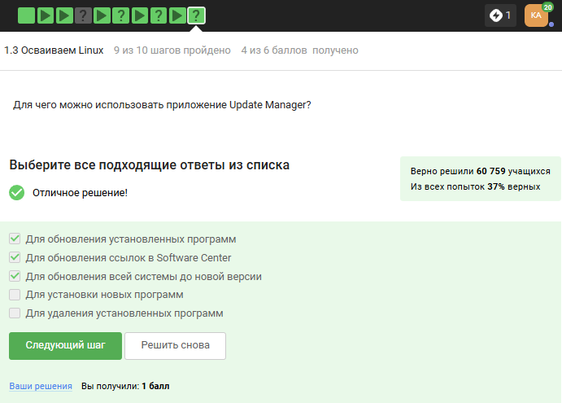

## 10) Ассоль - героиня литературного произведения, а термин - это определение. (рис. 10).
 
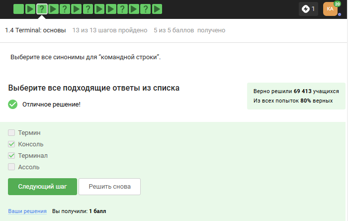

## 11) Интерфейс командной строки Linux является регистрозависимым. (рис. 11).
 

## 12) Интерфейс командной строки Linux является регистрозависимым, поэтому не подходит вариант, где буква А - маленькая(строчная). (рис. 12).
 
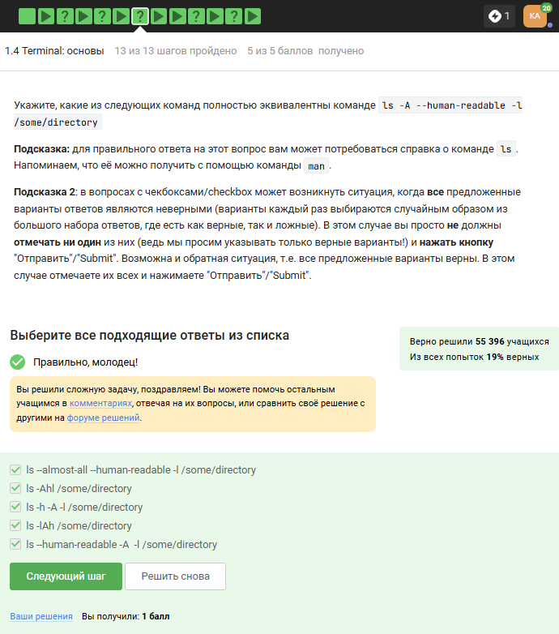

## 13) Я прописываю полный путь до директории Downloads, так как на данный момент нахожусь в другой директории. (рис. 13).
 
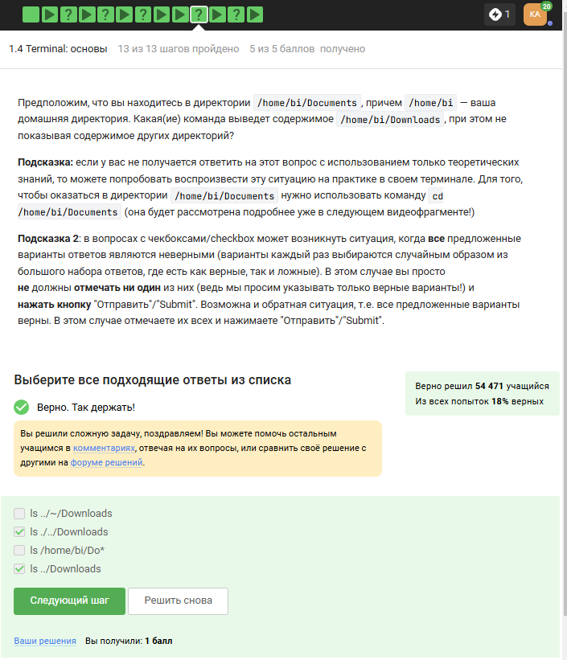

## 14) rm -r удаление директории и рекуррентное удаление файлов, находящихся в ней. (рис. 14).
 
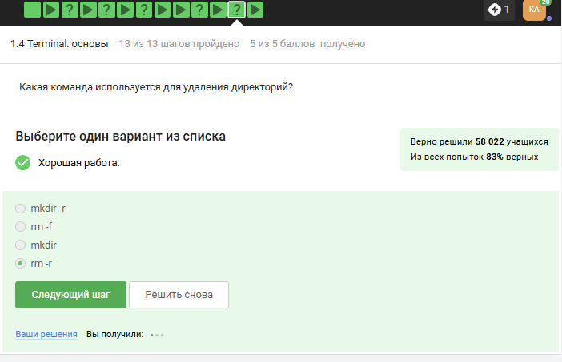

## 15) Это я проверила эмпирическим путём, что видно в ходе скринкаста. (рис. 15).
 

## 16) Это запуск программы в фоновом режиме. (рис. 16).
 
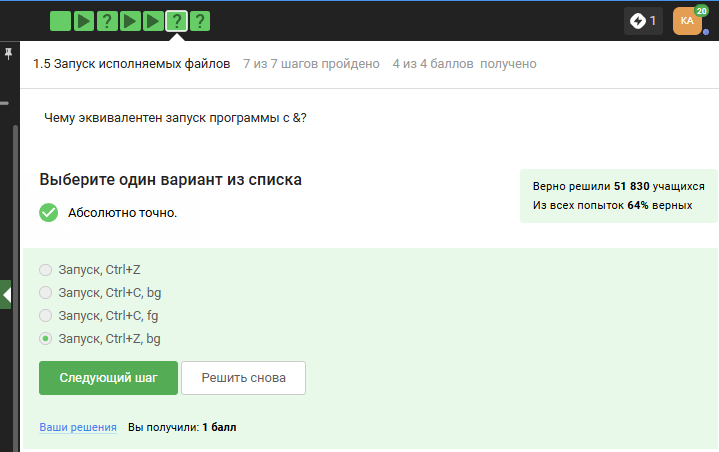

## 17) Здесь видно выполнение команды. (рис. 17).
 
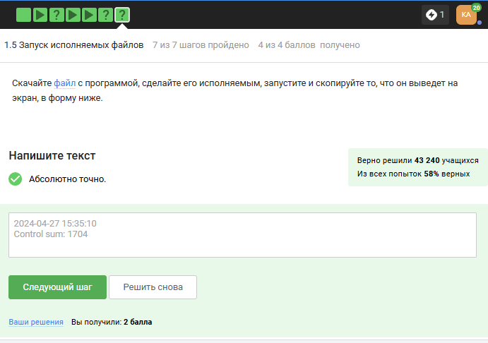

## 18) Автоматически поток ошибок выводится на экран - это видно, например, в ходе выполненных лабораторных. В файл будет поток выводиться, если его перенаправить. (рис. 18).
 
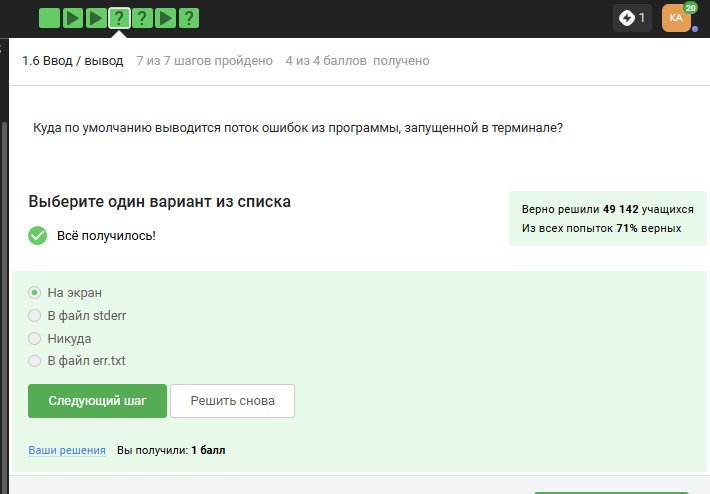

## 19) < file — использовать файл как источник данных для стандартного потока ввода.
file — направить стандартный поток вывода в файл. Если файл не существует, он будет создан, если существует — перезаписан сверху.
2> file — направить стандартный поток ошибок в файл. Если файл не существует, он будет создан, если существует — перезаписан сверху.
file — направить стандартный поток вывода в файл. Если файл не существует, он будет создан, если существует — данные будут дописаны к нему в конец.
2>>file — направить стандартный поток ошибок в файл. Если файл не существует, он будет создан, если существует — данные будут дописаны к нему в конец.
&>file или >&file — направить стандартный поток вывода и стандартный поток ошибок в файл. Другая форма записи: >file 2>&1. (рис. 19]).
 
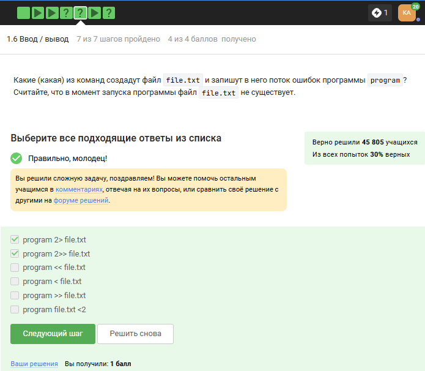

## 20) 1.  cat names.txt | ./interacter.py | less = вывод на экран 
2.  cat names.txt | ./interacter.py 2>err.txt | less = вывод ошибки в err.txt (рис. 20).
 
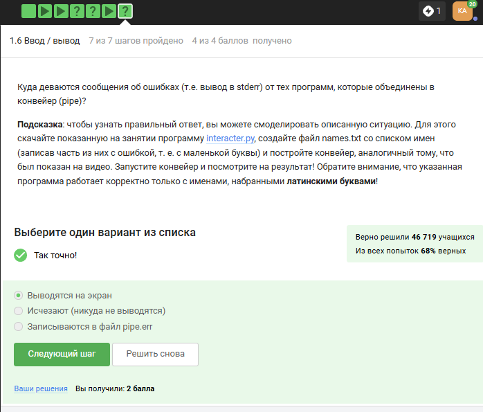

## 21) Команда wget -P /home/alex/Pictures http://example.com/example.PNG скачивает файл и даже размещает его, назвав example.PNG, в папке /home/alex/Pictures. Но после этих манипуляций срабатывает часть ключа -O 1.PNG и только что скачаный example.PNG конвертируется в 1.PNG и размещается в текущей директории, в которой мы находимся, потому что путь файла уже не указан, указано только название - 1.PNG. (рис. 21).
 
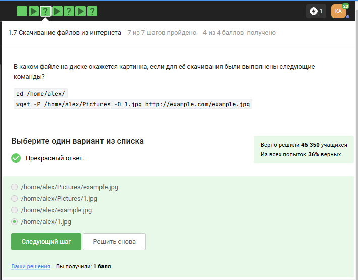

## 22) -q –quiet Turn off Wget’s output. (рис. 22).
 
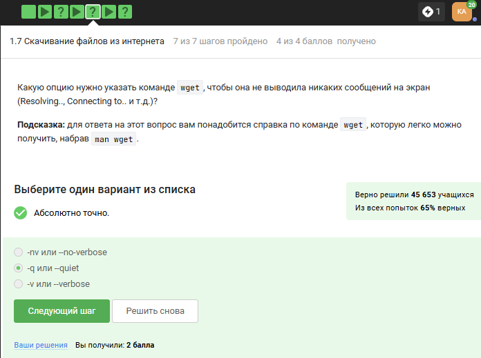

## 23) 4.2 Типы файлов
При загрузке материалов из Интернета вы часто захотите ограничить поиск только определенными типами файлов. Например, если вы заинтересованы в загрузке GIF-файлов, вы не будете рады получить кучу документов PostScript, и наоборот.
Wget предлагает две опции для решения этой проблемы. В описании каждой опции перечислены краткое имя, длинное имя и эквивалентная команда в .wgetrc.
‘-A acclist’ ‘–accept acclist’ ‘accept = acclist’ ‘–accept-regex urlregex’ ‘accept-regex = urlregex’
Аргумент опции '--accept' представляет собой список суффиксов или шаблонов файлов, которые Wget будет загружать при рекурсивном получении. Суффикс - это конечная часть файла, состоящая из "обычных" букв, например, 'gif' или '.PNG'. Шаблон совпадения содержит подстановочные знаки типа shell, например, 'books*'.

Таким образом, указав 'wget -A gif,PNG', Wget загрузит только файлы, заканчивающиеся на 'gif' или 'PNG', то есть GIF и JPEG. С другой стороны, 'wget -A "zelazny*196[0-9]*" загрузит только файлы, начинающиеся с 'zelazny' и содержащие в себе числа от 1960 до 1969. Описание того, как работает сопоставление шаблонов, можно найти в руководстве к вашей оболочке. (рис. 23).
 
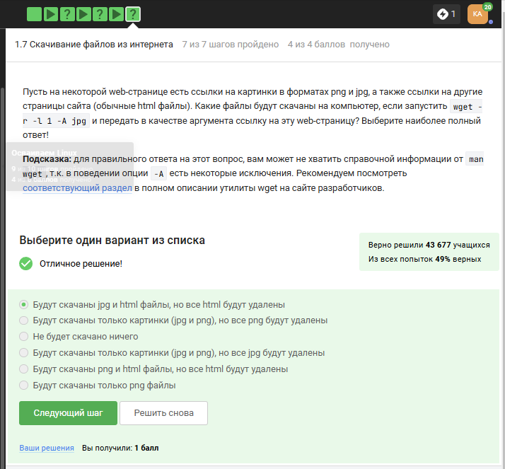

## 24) (рис. 24]).
 
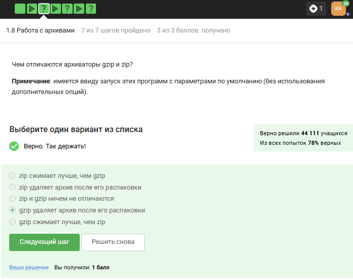

## 25) gzip (сокращение от GNU Zip) — утилита сжатия и восстановления (декомпрессии) файлов, использующая алгоритм Deflate. (рис. 25).
 
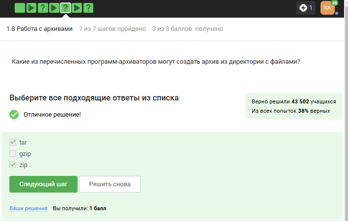

## 26) c - архиватор
j - указатель на тип архиватора bzip
f - потому что создаем архив в файловой системе (рис. 26).
 
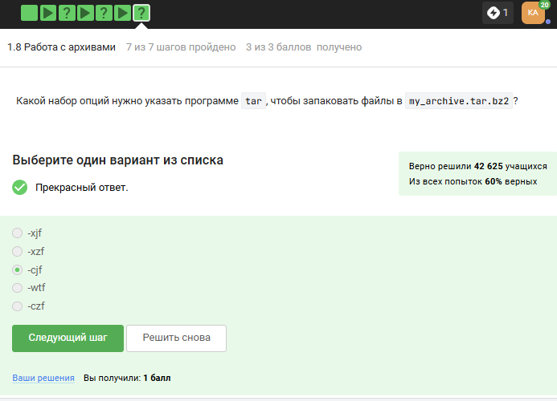

## 27) ? = один символ
alexey = маленькая буква
И файл должен быть jpeg, а не PNG (рис. 27).
 
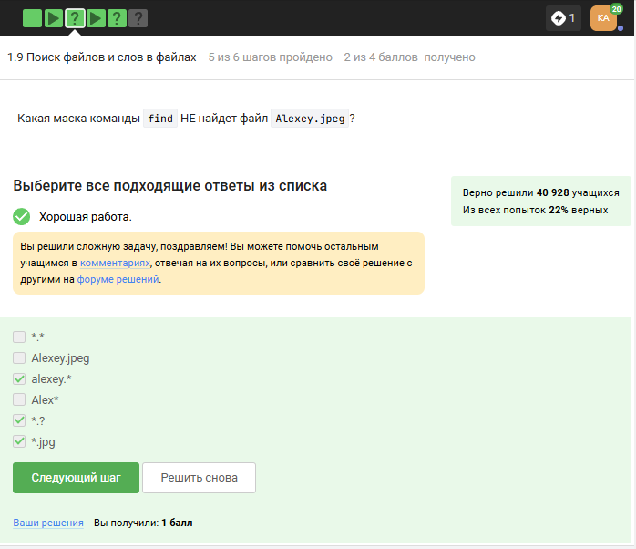

## 28) Регистр - маленькая буква, слово - world, а не word (рис. 28).
 
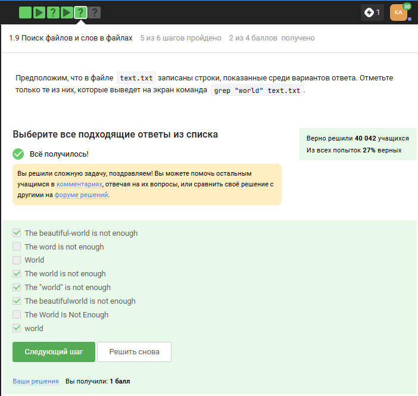

## 29) grep -r "love" ~/Shakespeare/ > 1_m.txt (рис. 29).

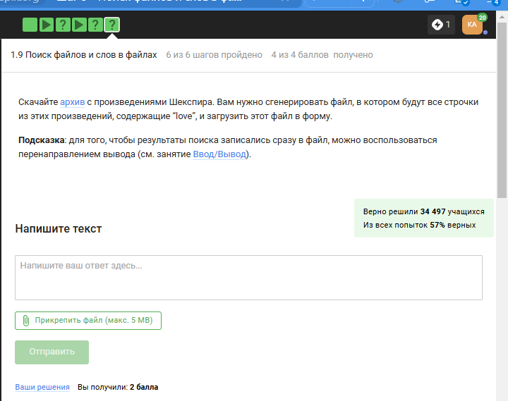

##  Выводы

Я просмотрела курс и освежила в памяти навыки работы с архивами, скачивание файлов, команды grep и тп.
