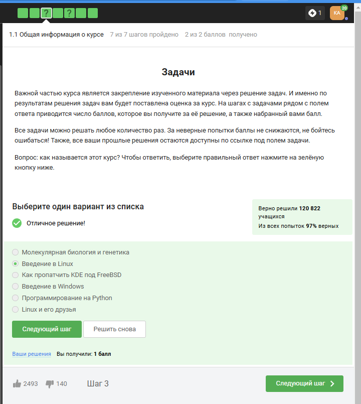
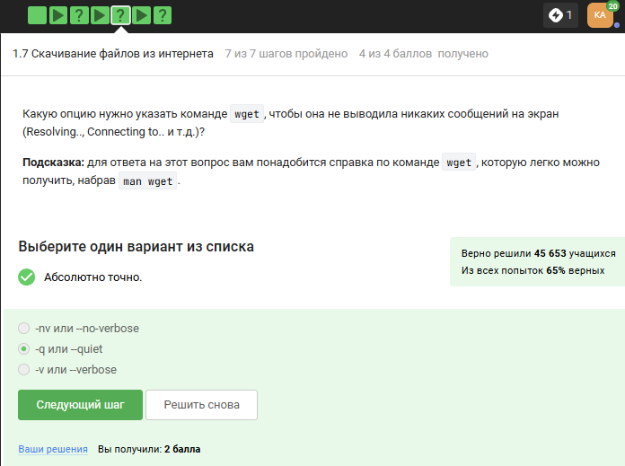

---
## Front matter
title: "Шаблон отчёта по лабораторной работе"
subtitle: "Простейший вариант"
author: "Дмитрий Сергеевич Кулябов"

## Generic otions
lang: ru-RU
toc-title: "Содержание"

## Bibliography
bibliography: bib/cite.bib
csl: pandoc/csl/gost-r-7-0-5-2008-numeric.csl

## Pdf output format
toc: true # Table of contents
toc-depth: 2
lof: true # List of figures
lot: true # List of tables
fontsize: 12pt
linestretch: 1.5
papersize: a4
documentclass: scrreprt
## I18n polyglossia
polyglossia-lang:
  name: russian
  options:
	- spelling=modern
	- babelshorthands=true
polyglossia-otherlangs:
  name: english
## I18n babel
babel-lang: russian
babel-otherlangs: english
## Fonts
mainfont: IBM Plex Serif
romanfont: IBM Plex Serif
sansfont: IBM Plex Sans
monofont: IBM Plex Mono
mathfont: STIX Two Math
mainfontoptions: Ligatures=Common,Ligatures=TeX,Scale=0.94
romanfontoptions: Ligatures=Common,Ligatures=TeX,Scale=0.94
sansfontoptions: Ligatures=Common,Ligatures=TeX,Scale=MatchLowercase,Scale=0.94
monofontoptions: Scale=MatchLowercase,Scale=0.94,FakeStretch=0.9
mathfontoptions:
## Biblatex
biblatex: true
biblio-style: "gost-numeric"
biblatexoptions:
  - parentracker=true
  - backend=biber
  - hyperref=auto
  - language=auto
  - autolang=other*
  - citestyle=gost-numeric
## Pandoc-crossref LaTeX customization
figureTitle: "Рис."
tableTitle: "Таблица"
listingTitle: "Листинг"
lofTitle: "Список иллюстраций"
lotTitle: "Список таблиц"
lolTitle: "Листинги"
## Misc options
indent: true
header-includes:
  - \usepackage{indentfirst}
  - \usepackage{float} # keep figures where there are in the text
  - \floatplacement{figure}{H} # keep figures where there are in the text
---

# Цель работы

Просмотреть видео и на основе полученной информации пройти тестовые задания.

# Задание

Просмотреть видео и на основе полученной информации пройти тестовые задания.

# Теоретическое введение

Линукс - в части случаев GNU/Linux — семейство Unix-подобных операционных систем на базе ядра Linux, включающих тот или иной набор утилит и программ проекта GNU, и, возможно, другие компоненты. Как и ядро Linux, системы на его основе, как правило, создаются и распространяются в соответствии с моделью разработки свободного и открытого программного обеспечения. Linux-системы распространяются в основном бесплатно в виде различных дистрибутивов — в форме, готовой для установки и удобной для сопровождения и обновлений, — и имеющих свой набор системных и прикладных компонентов, как свободных, так и проприетарных.

# Выполнение лабораторной работы

1) Курс действительно называется “Введение в Linux”, поэтому с этим вопросом проблем не возникло. (рис. [-@fig:001]).

{#fig:001 width=70%}

2) Прочитав критерии прохождения курса, я отметила необходимые утверждения. (рис. [-@fig:002]).

{#fig:002 width=70%}
 
3) Стандартная операционная система, предлагаемая большей частью магазинов - windows, именно она стоит у меня на основном компьютере. (рис. [-@fig:003]).

{#fig:003 width=70%}

4) На свой компьютер мы устанавливали специальную программу VirtualBox, которая нужна для подключения одной операционной на другой. (рис. [-@fig:004]).

{#fig:004 width=70%}

5) Да, моя виртуальная машина хорошо работает, и у меня получилось запустить с неё Линукс, но в последнее время я чаще использую ноутбук, на котором Линукс стоит как основная операционная система. (рис. [-@fig:005]).

{#fig:005 width=70%}

6) Я создала документ, и перед сохранением выбрала нужный формат, а после я ег прикрепила к курсу. Прикрепленный файл видно на скриншоте. (рис. [-@fig:006]).
 
{#fig:006 width=70%}

7) deb — формат пакетов операционных систем проекта Debian. Используется также их производными, такими как Ubuntu, Knoppix и другими. (рис. [-@fig:007]).
 
{#fig:007 width=70%}

8) Здесь на скриншоте видно, что установив программу медиапроигрывателя я посмотрела, кто авторы программы и записала первую фамилию. (рис. [-@fig:008]).
 
{#fig:008 width=70%}

9) Менеджер обновлений — это программа для обновления установленного программного обеспечения в дистрибутивах ОС Linux, основанных на Debian или использующих систему управления пакетами APT. Менеджер обновлений устанавливает обновления безопасности или просто улучшающие функциональность программы. (рис. [-@fig:009]).
 
{#fig:009 width=70%}

10) Ассоль - героиня литературного произведения, а термин - это определение. (рис. [-@fig:010]).
 
{#fig:010 width=70%}

11) Интерфейс командной строки Linux является регистрозависимым. (рис. [-@fig:011]).
 
{#fig:011 width=70%}

12) Интерфейс командной строки Linux является регистрозависимым, поэтому не подходит вариант, где буква А - маленькая(строчная). (рис. [-@fig:012]).
 
{#fig:012 width=70%}

13) Я прописываю полный путь до директории Downloads, так как на данный момент нахожусь в другой директории. (рис. [-@fig:013]).
 
{#fig:013 width=70%}

14) rm -r удаление директории и рекуррентное удаление файлов, находящихся в ней. (рис. [-@fig:014]).
 
{#fig:014 width=70%}

15) Это я проверила эмпирическим путём, что видно в ходе скринкаста. (рис. [-@fig:015]).
 
{#fig:015 width=70%}

16) Это запуск программы в фоновом режиме. (рис. [-@fig:016]).
 
{#fig:016 width=70%}

17) Здесь видно выполнение команды. (рис. [-@fig:017]).
 
{#fig:017 width=70%}

18) Автоматически поток ошибок выводится на экран - это видно, например, в ходе выполненных лабораторных. В файл будет поток выводиться, если его перенаправить. (рис. [-@fig:018]).
 
{#fig:018 width=70%}

19) < file — использовать файл как источник данных для стандартного потока ввода.
file — направить стандартный поток вывода в файл. Если файл не существует, он будет создан, если существует — перезаписан сверху.
2> file — направить стандартный поток ошибок в файл. Если файл не существует, он будет создан, если существует — перезаписан сверху.
file — направить стандартный поток вывода в файл. Если файл не существует, он будет создан, если существует — данные будут дописаны к нему в конец.
2>>file — направить стандартный поток ошибок в файл. Если файл не существует, он будет создан, если существует — данные будут дописаны к нему в конец.
&>file или >&file — направить стандартный поток вывода и стандартный поток ошибок в файл. Другая форма записи: >file 2>&1. (рис. [-@fig:019]).
 
{#fig:019 width=70%}

20) 1.  cat names.txt | ./interacter.py | less = вывод на экран 
2.  cat names.txt | ./interacter.py 2>err.txt | less = вывод ошибки в err.txt (рис. [-@fig:020]).
 
{#fig:020 width=70%}

21) Команда wget -P /home/alex/Pictures http://example.com/example.PNG скачивает файл и даже размещает его, назвав example.PNG, в папке /home/alex/Pictures. Но после этих манипуляций срабатывает часть ключа -O 1.PNG и только что скачаный example.PNG конвертируется в 1.PNG и размещается в текущей директории, в которой мы находимся, потому что путь файла уже не указан, указано только название - 1.PNG. (рис. [-@fig:021]).
 
{#fig:021 width=70%}

22) -q –quiet Turn off Wget’s output. (рис. [-@fig:022]).
 
{#fig:022 width=70%}

23) 4.2 Типы файлов
При загрузке материалов из Интернета вы часто захотите ограничить поиск только определенными типами файлов. Например, если вы заинтересованы в загрузке GIF-файлов, вы не будете рады получить кучу документов PostScript, и наоборот.
Wget предлагает две опции для решения этой проблемы. В описании каждой опции перечислены краткое имя, длинное имя и эквивалентная команда в .wgetrc.
‘-A acclist’ ‘–accept acclist’ ‘accept = acclist’ ‘–accept-regex urlregex’ ‘accept-regex = urlregex’
Аргумент опции '--accept' представляет собой список суффиксов или шаблонов файлов, которые Wget будет загружать при рекурсивном получении. Суффикс - это конечная часть файла, состоящая из "обычных" букв, например, 'gif' или '.PNG'. Шаблон совпадения содержит подстановочные знаки типа shell, например, 'books*'.

Таким образом, указав 'wget -A gif,PNG', Wget загрузит только файлы, заканчивающиеся на 'gif' или 'PNG', то есть GIF и JPEG. С другой стороны, 'wget -A "zelazny*196[0-9]*" загрузит только файлы, начинающиеся с 'zelazny' и содержащие в себе числа от 1960 до 1969. Описание того, как работает сопоставление шаблонов, можно найти в руководстве к вашей оболочке. (рис. [-@fig:023]).
 
{#fig:023 width=70%}

24) (рис. [-@fig:024]).
 
{#fig:024 width=70%}

25) gzip (сокращение от GNU Zip) — утилита сжатия и восстановления (декомпрессии) файлов, использующая алгоритм Deflate. (рис. [-@fig:025]).
 
{#fig:025 width=70%}

26) c - архиватор
j - указатель на тип архиватора bzip
f - потому что создаем архив в файловой системе (рис. [-@fig:026]).
 
{#fig:026 width=70%}

27) ? = один символ
alexey = маленькая буква
И файл должен быть jpeg, а не PNG (рис. [-@fig:027]).
 
{#fig:027 width=70%}

28) Регистр - маленькая буква, слово - world, а не word (рис. [-@fig:028]).
 
{#fig:028 width=70%}

29) grep -r "love" ~/Shakespeare/ > 1_m.txt (рис. [-@fig:029]).

{#fig:029 width=70%}

# Выводы

Я просмотрела курс и освежила в памяти навыки работы с архивами, скачивание файлов, команды grep и тп.
Список литературы

# Список литературы{.unnumbered}

::: {#refs}
:::
