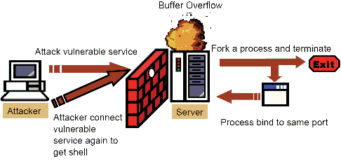
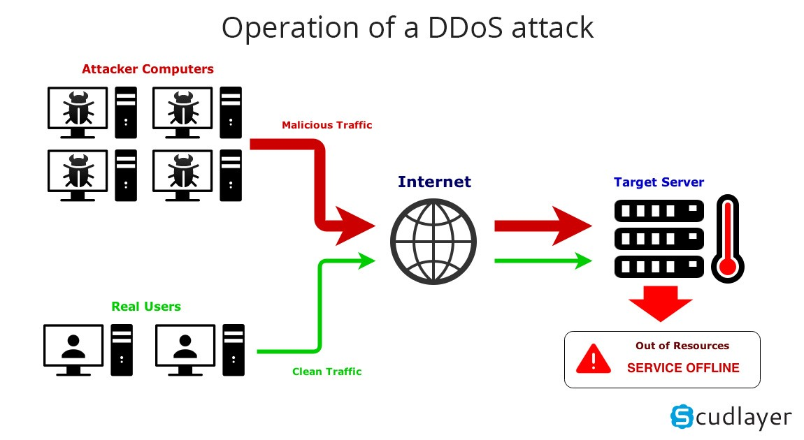
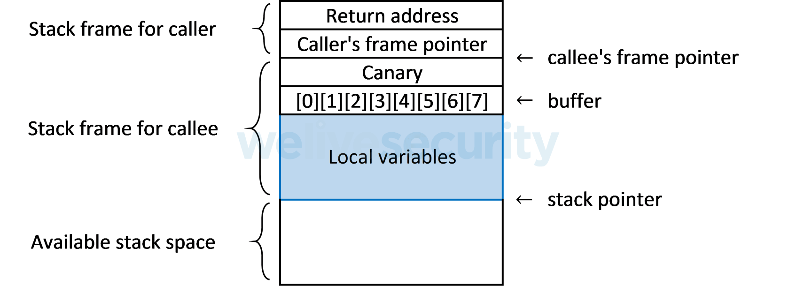
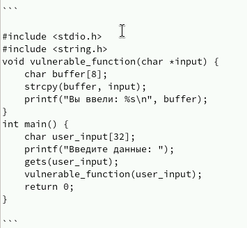
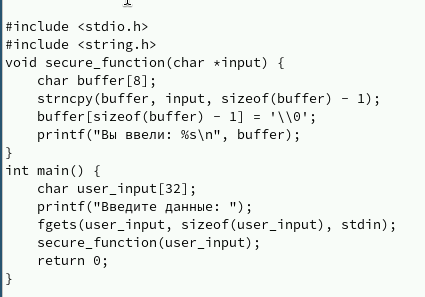

# Информация

## Докладчик

:::::::::::::: {.columns align=center}
::: {.column width="70%"}

- Клименко Алёна Сергеевна  
- НКАбд-02-2024 № Студенческого билета: 1132246741  
- Российский университет дружбы народов  
- <https://github.com/Alstrr/study_2024-2025_os-intro>

:::
::: {.column width="30%"}

:::
::::::::::::::

# Введение

## Определение проблемы

Атака переполнения буфера — это одна из наиболее распространённых уязвимостей в программном обеспечении, которая позволяет злоумышленнику записывать данные за пределы выделенной памяти, что может привести к исполнению вредоносного кода.

##

# Основные методы защиты

## Безопасное программирование

Безопасное программирование включает:

- Использование безопасных функций
- Проверку границ буфера
- Анализ кода и статическую проверку

Например:
заменить gets() на fgets(), использовать strncpy() вместо strcpy(), применять snprintf() вместо sprintf().

##

## Внедрение механизмов защиты

- ASLR (Address Space Layout Randomization) — случайное размещение областей памяти процесса  
- DEP (Data Execution Prevention) — запрет на выполнение кода в сегментах данных  
- Stack Canaries — специальные метки, проверяющие целостность стека

## 

## Stack Canaries (канарейки)

В стек между локальными переменными и адресом возврата добавляется специальное значение (канарейка).  
Если оно изменено — программа аварийно завершается, предотвращая выполнение вредоносного кода.

## ASLR (Address Space Layout Randomization)

Случайное расположение стека, кучи, сегментов кода и библиотек в памяти делает сложнее предугадать адреса, куда можно направить управление.

## DEP / NX (Data Execution Prevention / No-eXecute bit)

Запрещает выполнение кода в сегментах данных, например, в стеке и куче.  
Даже если злоумышленник внедрил код — он не выполнится.

## Безопасные языки программирования и компиляторы с защитой

- Языки: Python, Java, Rust — встроенные механизмы защиты памяти  
- Компиляторы: включают защиту на этапе сборки

Дополнительно:

- Флаги безопасности (`-fstack-protector`, `-D_FORTIFY_SOURCE`)
- Автоматическое внедрение защит (stack smashing protection, PIE)

## Аппаратные меры

Современные процессоры реализуют защиту на уровне архитектуры:

- NX бит в x86 — запрещает выполнение кода в данных
- ARM — контроль исполнения, защита доступа, тегирование памяти

# Примеры атак и защиты

## Демонстрация переполнения буфера

## Исправленный код с защитой

# Заключение

Ни один метод не даёт 100% гарантии.  
Только комплексный подход — безопасное программирование, флаги компиляции, аппаратная защита и рандомизация памяти — может эффективно предотвращать атаки на переполнение буфера.

## Список литературы

1. Aleph One. *Smashing The Stack For Fun And Profit*. Phrack Magazine, 1996.  
2. Microsoft Security. *Data Execution Prevention (DEP)*. Microsoft Docs.  
3. PaX Team. *Address Space Layout Randomization*. PaX Documentation.