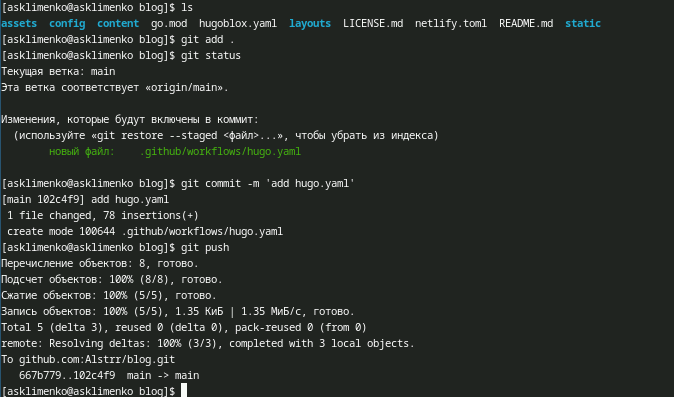

---
## Front matter
lang: ru-RU
title: Презентация 1 этап индивидуального проекта
subtitle: Операционные системы
author:
  - Клименко Алёна Сергеевна
institute:
  - Российский университет дружбы народов, Москва, Россия

## i18n babel
babel-lang: russian
babel-otherlangs: english

## Formatting pdf
toc: false
toc-title: Содержание
slide_level: 2
aspectratio: 169
section-titles: true
theme: metropolis
header-includes:
 - \metroset{progressbar=frametitle,sectionpage=progressbar,numbering=fraction}
---

# Информация

## Докладчик

:::::::::::::: {.columns align=center}
::: {.column width="70%"}

  * Клименко Алёна Сергеевна
  * НКАбд-02-2024 № Студенческого билета: 1132246741
  * Российский университет дружбы народов
  * <https://github.com/Alstrr/study_2024-2025_os-intro>

:::
::: {.column width="30%"}

:::
::::::::::::::

## Цель работы

Размещение на Github pages заготовки для персонального сайта.

## Задание

1. Установить необходимое программное обеспечение.
2. Скачать шаблон темы сайта.
3. Разместить его на хостинге git.
4. Установить параметр для URLs сайта.
5. Разместить заготовку сайта на Github pages.

## Выполнение лабораторной работы

скачиваем архив hugo с офиц репозитория (рис. [-@fig:001]).

{#fig:001 width=70%}

##

разархивируем файл и перенесем hugo в usr/local/bin (рис. [-@fig:002]).

{#fig:002 width=70%}

##

Создаем репозиторий на github. клонируем его создаем с помощью команды mkdir -p нужные нам папки и переносим туда hugo.yaml (рис. [-@fig:003]).

{#fig:003 width=70%}

##

вфгружаем и коммитим все (рис. [-@fig:004]).

{#fig:004 width=70%}

##

открываем шаблон сайта созданые на моем репозитории (рис. [-@fig:005]).

{#fig:005 width=70%}

## Выводы

Разместила на Github pages заготовки для персонального сайта.