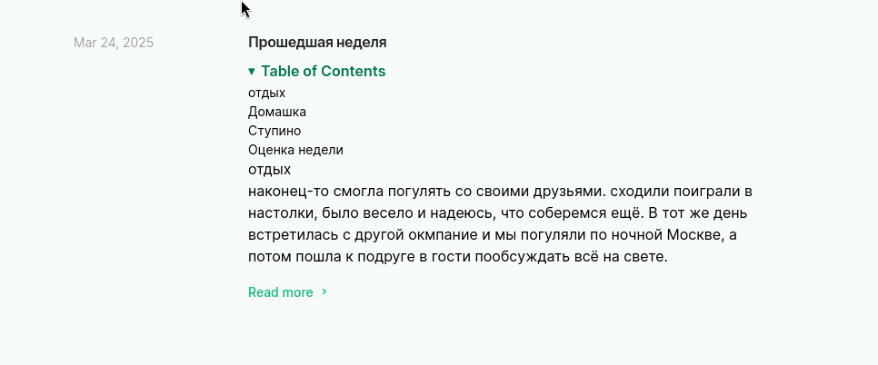
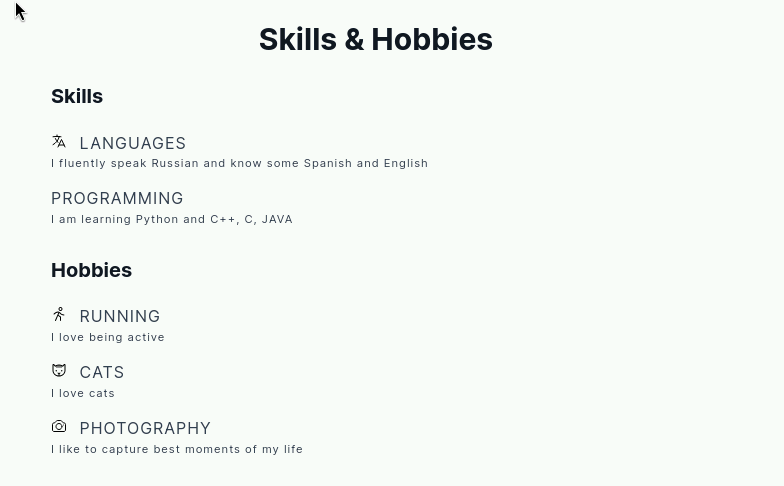
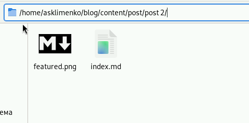

---
## Front matter
lang: ru-RU
title: Презентация 3 этап индивидуального проекта
subtitle: Операционные системы
author:
  - Клименко Алёна Сергеевна
institute:
  - Российский университет дружбы народов, Москва, Россия

## i18n babel
babel-lang: russian
babel-otherlangs: english

## Formatting pdf
toc: false
toc-title: Содержание
slide_level: 2
aspectratio: 169
section-titles: true
theme: metropolis
header-includes:
 - \metroset{progressbar=frametitle,sectionpage=progressbar,numbering=fraction}
---

# Информация

## Докладчик

:::::::::::::: {.columns align=center}
::: {.column width="70%"}

  * Клименко Алёна Сергеевна
  * НКАбд-02-2024 № Студенческого билета: 1132246741
  * Российский университет дружбы народов
  * <https://github.com/Alstrr/study_2024-2025_os-intro>

:::
::: {.column width="30%"}

:::
::::::::::::::

## Цель работы

Продолжить работу с сайтом, редактировать его в соответствии с требованиями, добавить данные о себе на сайт.

## Задание

1. Разместить фотографию владельца сайта.
2. Разместить краткое описание владельца сайта (Biography).
3. Добавить информацию об интересах (Interests).
4. Добавить информацию от образовании (Education).
5. Сделать пост по прошедшей неделе.
6. Добавить пост на тему по выбору: Управление версиями. Git. Непрерывная интеграция и непрерывное развертывание (CI/CD).

# Выполнение индивидуального проекта

## создание отчета о прошедшей неделе, редактирование файла index.md, перенос фотографии для отображения на сайте  (рис. 1).

## создание поста на выбор, я решила написать о пост о разметке markdown, редактирование файла index.md, перенос фотографии для отображения на сайте (рис. 2).

## skills, experience (рис. 3).

## каталог с фотографией для сайта и с файлом, в котором записана информация выгруженная на сайт (рис. 4).

##  Выводы

Мы продолжили работу с сайтом, редактировали его в соответствии с требованиями, добавили данные о себе на сайт.

##  Список литературы{.unnumbered}
 

::: {#refs}
:::